# Validation

Each result on this page comes from a run of Mallard 0.4.0 (double precision, default settings, including the low-Mach correction of the convective flux), unless a section says otherwise, with the inputs described, compared with an exact solution, theory, or published reference data. Most cases start from an input in Mallard's [examples](docs/examples.md); the scripts that ran every case and drew every figure are in the [website repository](https://github.com/MatthewBonanni/mallard-website/tree/main/validation). Mallard's test suite checks many of the same properties at smaller scale on every change.

| Case | Quantity | Mallard | Reference |
|---|---|---|---|
| [Sod shock tube](#sod-shock-tube) | L1 density error, 200 cells | 2.4 × 10−3 | exact solution |
| [Shu–Osher problem](#shu-osher-problem) | L1 density difference, 400 / 800 cells | 0.20 / 0.11 | WENO5 at 12,800 cells; WENO5 at the same resolution: 0.29 / 0.10 |
| [Oblique shock](#oblique-shock) | shock angle, pressure ratio | 42.82°, 1.4984 | 42.82°, 1.4984 (theory) |
| [Isentropic vortex](#design-order-convergence) | order of accuracy, TENO-E orders 3–6 | 2.99, 4.02, 4.98, 6.03 (quads); 3.00, 4.01, 4.99, 5.99 (triangles) | 3, 4, 5, 6 |
| [Vortex across a periodic seam](#periodic-seams) | order of accuracy, TENO-E orders 3–6 | 2.91, 4.08, 4.87, 6.15 (quads); 2.98, 4.03, 4.94, 6.05 (triangles) | 3, 4, 5, 6 |
| [Viscous exact solutions](#viscous-exact-solutions) | Stokes' first problem: order of accuracy, largest error at 128 rows | second order, 0.0099% of U (quads); order 1.9–2.0, 0.0093% of U (triangles) | exact solution |
| [Cylinder, Re = 100](#cylinder-at-re-100) | St, mean CD, CL amplitude | 0.165, 1.368, 0.331 | 0.164–0.165, 1.33–1.35, 0.33–0.34 |
| [Viscous shock tube](#viscous-shock-tube) | wall density RMS difference; lambda-shock triple point | 0.56 (range 37–118); (0.581, 0.138) | Zhou et al. (2018), 1500 × 750 grid: (0.58, 0.137) |
| [Spherical explosion](#spherical-explosion) (3D) | mean density difference, 64³ hexahedra | 0.004 | 1D radial solution, 4000 cells |
| [Sedov–Taylor blast wave](#sedov-taylor) (3D) | shock radius error at t = 0.8 | +1.1% | exact similarity solution |
| [Taylor–Green vortex, Re = 1600](#taylor-green-vortex) (3D) | kinetic energy, largest deviation over t = 0–20; peak dissipation rate, at t | 2.6%; 0.01161 at 8.39 (128³) | 512³ spectral DNS: 0.01286 at 8.97 |
| [Sphere, Re = 300](#sphere-re300) (3D) | St, mean CD, mean CL (2.06M cells) | 0.133, 0.666, 0.070 | 0.134–0.137, 0.655–0.671, 0.065–0.069 |
| [Mach 3 sphere](#mach-3-sphere) (3D) | bow-shock standoff Δ/R; stagnation pressure | 0.226; 12.0 | 0.205 (Billig); 12.06 (pitot) |
| [0D ignition](#ignition) (reacting) | ignition delay, 36 H2/air and CH4/air mixtures; final temperature | within 3 × 10−6 (H2), 2 × 10−4 (CH4); within 10−5 K | Cantera reactor; Cantera equilibrium |
| [Reactive shock tube](#reactive-shock-tube) (reacting) | reaction front at 230 µs, 50 / 25 / 12.5 µm cells | @RST_FRONTS@ mm | converges under refinement |
| [CJ detonation](#detonation) (reacting) | front speed; induction length; peak pressure, at 10 / 20 / 40 cells per induction length | @DET_SUMMARY@ | DCJ 1616.9 m/s; ZND 1.525 mm; von Neumann 174.7 kPa |

## Sod shock tube {#sod-shock-tube}

The Riemann problem of Sod (1978): (ρ, u, p) = (1, 0, 1) for x < 0.5 and (0.125, 0, 0.1) for x > 0.5, γ = 1.4, at t = 0.2. The [`sod`](docs/examples.md) example: a strip of N × 4 square quadrilaterals with slip walls, HLLC flux, SSPRK3 at CFL 0.5.

<figure class="mallard-figure" markdown>
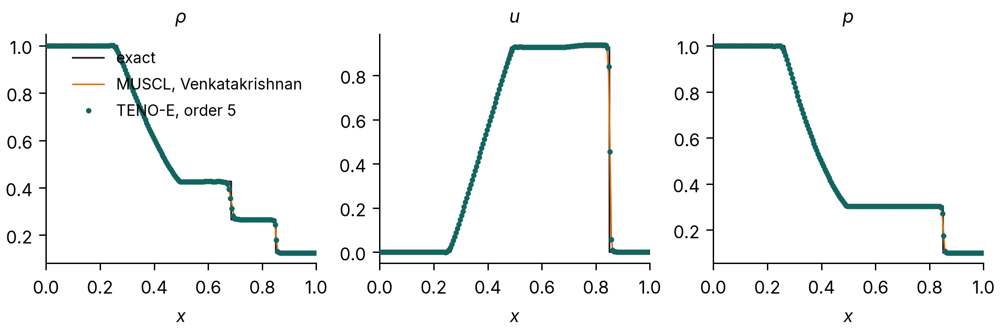{ loading=lazy width=2158 height=718 }
<figcaption>Sod shock tube at t = 0.2 on 200 cells. Fifth-order TENO-E (dots) and MUSCL with the Venkatakrishnan limiter (line) against the exact solution.</figcaption>
</figure>

L1 error of the cell-averaged density, ∫|ρ − ρexact| dx, with the exact solution averaged over each cell, over all cells of the strip:

| Cells | TENO-E 5 | rate | MUSCL | rate |
|---:|---:|---:|---:|---:|
| 100 | 4.16 × 10−3 |  | 4.46 × 10−3 |  |
| 200 | 2.41 × 10−3 | 0.79 | 2.65 × 10−3 | 0.75 |
| 400 | 1.27 × 10−3 | 0.93 | 1.43 × 10−3 | 0.89 |
| 800 | 7.24 × 10−4 | 0.81 | 7.65 × 10−4 | 0.90 |

Both schemes converge at close to first order, the expected rate for a solution with a shock and a contact discontinuity; TENO-E has 5–12% lower error than MUSCL. The shock spans two cells and the contact discontinuity about five.

Mallard 0.4.0 changed TENO-E next to walls (complete stencils and a conditioning bound for the central stencil), so that the four rows of the strip now stay identical up to 400 cells; with 0.3.0 the rows next to the slip walls differed from the inner two by up to 0.014 in density, and the 0.3.0 errors on this page (3.92, 2.28, 1.21 and 0.60 × 10−3) were those of the bottom row alone. On 800 cells the rows still differ by up to 0.005 behind the shock with HLLC, and by 0.001 with HLL or RHLL: the grid-aligned shock instability discussed under [Shu–Osher](#shu-osher-problem). MUSCL results are unchanged from 0.3.0.

## Shu–Osher problem {#shu-osher-problem}

A Mach 3 shock running into a sinusoidal density field (Shu & Osher 1989), on [0, 10] (the usual [−5, 5] shifted by 5), t = 1.8, with the [`shu_osher`](docs/examples.md) example: fifth-order TENO-E and the RHLL flux on N × 4 square quadrilaterals. There is no exact solution; the reference is a one-dimensional fifth-order WENO-JS solution (characteristic, Lax–Friedrichs flux splitting, SSPRK3) on 12,800 cells, which differs from the same code on 6,400 cells by 0.007 in L1.

<figure class="mallard-figure" markdown>
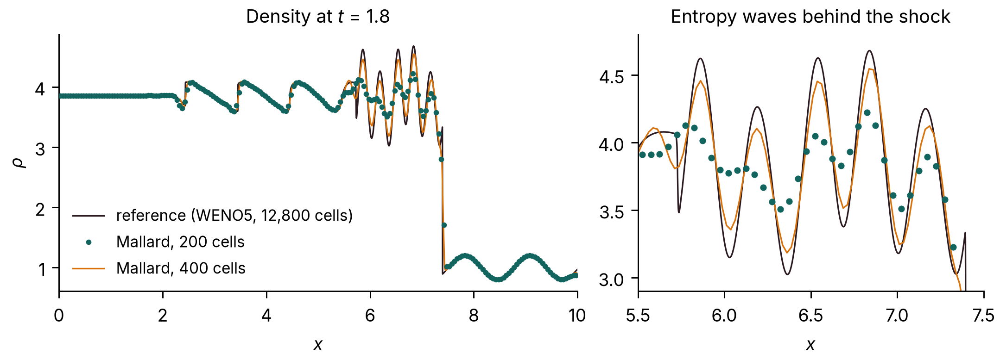{ loading=lazy width=2158 height=778 }
<figcaption>Shu–Osher problem at t = 1.8: fifth-order TENO-E with the RHLL flux on 200 and 400 cells against the 12,800-cell reference. Right: the entropy waves generated behind the shock, the part of the solution that separates high-order schemes.</figcaption>
</figure>

L1 density difference from the reference, ∫|ρ − ρref| dx:

| Cells | Mallard, RHLL | Mallard, HLLC | 1D WENO5, same cells |
|---:|---:|---:|---:|
| 200 | 0.66 | 0.65 | 0.75 |
| 400 | 0.20 | 0.20 | 0.29 |
| 800 | 0.11 | 0.49 | 0.10 |
| 1600 | 0.059 | 0.78 | 0.048 |

With the rotated-hybrid RHLL flux, Mallard converges to the reference, more accurate than the one-dimensional WENO5 scheme on 200 and 400 cells and within 7% of it on 800 (0.4.0 lowered the error on 400 and 1600 cells by 22% and 28% from 0.3.0's 0.26 and 0.082). With HLLC it does not converge beyond 400 cells: behind the Mach 3 shock, which moves along the grid lines of the strip, the flow develops transverse disturbances (on 1600 × 4 cells the density differs by up to 1.1 between rows of a problem that should stay one-dimensional) that destroy the entropy waves. This is the grid-aligned shock instability that Quirk (1994) described for Roe's scheme and to which HLLC is also prone; use `RHLL` for strong shocks aligned with quadrilateral grids. The example has used RHLL since Mallard 0.3.0 (0.2.0's used HLLC). With RHLL the rows still differ by up to 0.26 on 800 cells and 0.16 on 1600 in the entropy-wave region, which accounts for part of its remaining difference from the one-dimensional reference at 1600 cells.

<figure class="mallard-figure" markdown>
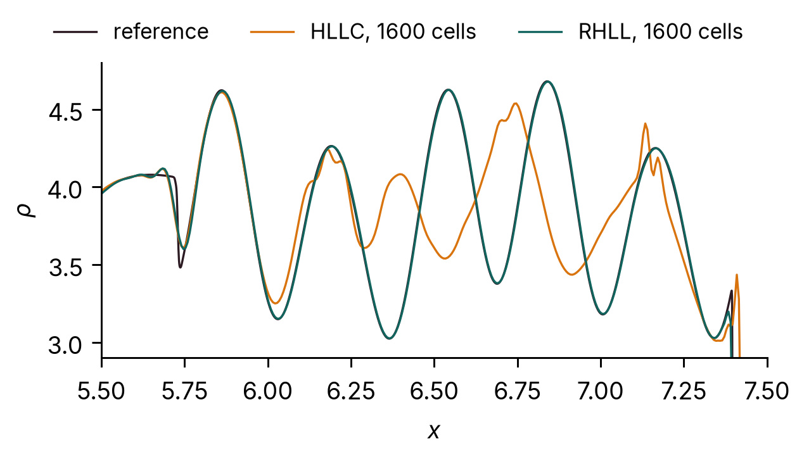{ loading=lazy width=1258 height=714 style="max-width: 32rem" }
<figcaption>Entropy waves on 1600 cells with the HLLC and RHLL fluxes.</figcaption>
</figure>

## Oblique shock {#oblique-shock}

Mach 1.758 flow (u = 600 m/s, T = 300 K, R = 277.4 J/(kg K)) over an 8° compression ramp, the [`wedge`](docs/examples.md) example: 160 × 120 quadrilaterals, HLLC, SSPRK3, run to t = 0.02 s (six flow-through times). The oblique-shock relations give a shock angle β = 42.816° and a pressure ratio p2/p1 = 1.4984. The measured angle is a straight-line fit to the half-jump pressure contour for 0.7 < x < 1.6 m; the pressure ratio is the mean over the cells 0.03–0.12 m above the ramp for 0.9 < x < 1.1 m.

<figure class="mallard-figure" markdown>
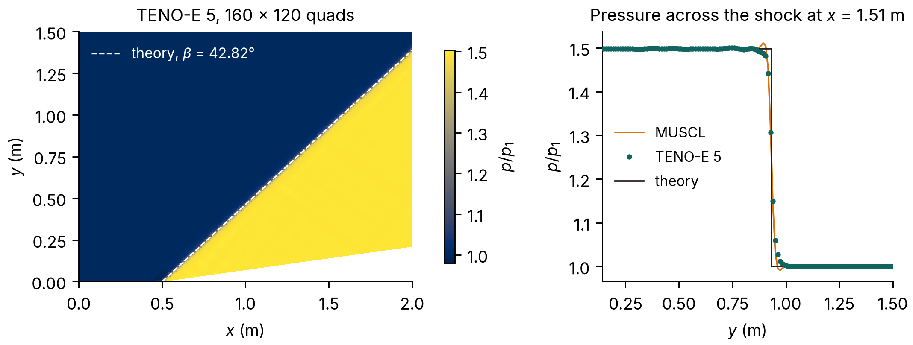{ loading=lazy width=2136 height=808 }
<figcaption>Left: pressure with the theoretical shock (dashed). Right: pressure across the shock at x = 1.51 m with MUSCL and fifth-order TENO-E against the theoretical jump.</figcaption>
</figure>

| Source | Shock angle | Error | p2/p1 | Error |
|---|---:|---:|---:|---:|
| Theory | 42.816° | | 1.4984 | |
| MUSCL | 42.814° | −0.002° | 1.4984 | < 0.01% |
| TENO-E 5 | 42.826° | +0.011° | 1.4985 | +0.01% |

The fitted shock passes through x = 0.4997 m at y = 0, the ramp corner being at x = 0.5 m. MUSCL results are unchanged from Mallard 0.3.0; with 0.4.0's TENO-E changes next to walls, the TENO-E shock angle moved from 42.821° to 42.826°.

## Design-order convergence {#design-order-convergence}

The isentropic vortex (Shu 1998) is an exact solution of the Euler equations: a vortex of strength β = 5 in a uniform stream (ρ, u, v, p) = (1, 1, 0.5, 1), γ = 1.4, translating without change of shape. It runs on [0, 14]² from (6.5, 6.75) to t = 1, with the exact moving solution imposed on all four boundaries (`dirichlet` conditions with expressions in x, y and t), on N × N quadrilaterals and on the same grids split into 2N² triangles, N = 28 to 448. TENO-E of orders 3 to 6, HLLC flux, RK4. The time step is 0.1 h for orders 3 and 4 and 0.1 h (h / h0)(p − 4)/4 for orders p = 5 and 6 (h0 = 1/2), so that the fourth-order time error falls at least as fast as the spatial error. The error is the area-weighted mean of |ρ − ρexact| over all cells, with the exact cell averages from a degree-5 quadrature on 16 sub-triangles of each triangle.

<figure class="mallard-figure" markdown>
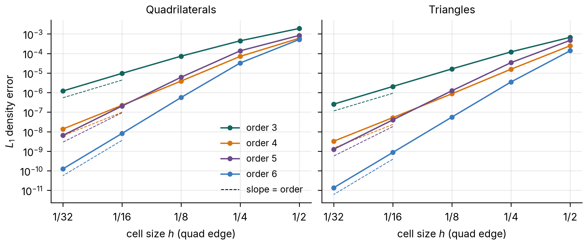{ loading=lazy width=2158 height=898 }
<figcaption>Mean density error of the isentropic vortex at t = 1 against the cell size h (the edge of the quadrilaterals, which the triangles split in two). Dashed lines have slopes 3 to 6.</figcaption>
</figure>

Every order converges at its design rate on both meshes: between the two finest grids the observed orders are 2.99, 4.02, 4.98 and 6.03 on quadrilaterals and 3.00, 4.01, 4.99 and 5.99 on triangles. On the coarsest grids, with only a few cells across the vortex core, the error has not yet reached its asymptotic rate. The maximum error converges at nearly the same rates (2.97 to 6.06 between the two finest grids).

**Quadrilaterals**

| h | order 3 | rate | order 4 | rate | order 5 | rate | order 6 | rate |
|---:|---:|---:|---:|---:|---:|---:|---:|---:|
| 1/2 | 1.79 × 10−3 |  | 5.99 × 10−4 |  | 8.41 × 10−4 |  | 5.22 × 10−4 |  |
| 1/4 | 4.28 × 10−4 | 2.06 | 6.88 × 10−5 | 3.12 | 1.33 × 10−4 | 2.66 | 3.15 × 10−5 | 4.05 |
| 1/8 | 6.96 × 10−5 | 2.62 | 3.85 × 10−6 | 4.16 | 5.90 × 10−6 | 4.50 | 5.56 × 10−7 | 5.82 |
| 1/16 | 9.15 × 10−6 | 2.93 | 2.24 × 10−7 | 4.10 | 1.97 × 10−7 | 4.90 | 8.15 × 10−9 | 6.09 |
| 1/32 | 1.15 × 10−6 | 2.99 | 1.38 × 10−8 | 4.02 | 6.23 × 10−9 | 4.98 | 1.25 × 10−10 | 6.03 |

**Triangles**

| h | order 3 | rate | order 4 | rate | order 5 | rate | order 6 | rate |
|---:|---:|---:|---:|---:|---:|---:|---:|---:|
| 1/2 | 6.61 × 10−4 |  | 2.48 × 10−4 |  | 4.67 × 10−4 |  | 1.36 × 10−4 |  |
| 1/4 | 1.18 × 10−4 | 2.48 | 1.57 × 10−5 | 3.98 | 3.32 × 10−5 | 3.81 | 3.45 × 10−6 | 5.30 |
| 1/8 | 1.58 × 10−5 | 2.90 | 8.70 × 10−7 | 4.17 | 1.21 × 10−6 | 4.78 | 5.59 × 10−8 | 5.95 |
| 1/16 | 1.99 × 10−6 | 2.99 | 5.24 × 10−8 | 4.05 | 3.89 × 10−8 | 4.96 | 8.69 × 10−10 | 6.01 |
| 1/32 | 2.48 × 10−7 | 3.00 | 3.26 × 10−9 | 4.01 | 1.22 × 10−9 | 4.99 | 1.36 × 10−11 | 5.99 |

### Across periodic seams {#periodic-seams}

Mallard 0.3.0 makes generated meshes periodic (`[mesh] periodic = ["x", "y"]`): the faces on opposite sides of the box become interior faces, and every stencil reaches across them. To check that the seam costs no accuracy, the same vortex runs in the doubly periodic box [0, 14]², starting centered 1 unit inside the right edge, so that it straddles the seam, and moving with (u, v) = (1, 0) to t = 2, through the seam to the other side. Initial data and the exact solution use the nearest periodic image; everything else is as above, on N = 28 to 224.

Between the two finest grids the observed orders are 2.91, 4.08, 4.87 and 6.15 on quadrilaterals and 2.98, 4.03, 4.94 and 6.05 on triangles: the design orders, as without the seam. Without boundaries, these runs are not affected by 0.4.0's changes to TENO-E next to walls: the errors are those of 0.3.0 to seven digits. Since 0.4.0, meshes read from Gmsh files can be periodic too, by pairing boundary zones in [`[[periodic]]`](docs/input.md#periodic) tables.

**Quadrilaterals, periodic**

| h | order 3 | rate | order 4 | rate | order 5 | rate | order 6 | rate |
|---:|---:|---:|---:|---:|---:|---:|---:|---:|
| 1/2 | 2.80 × 10−3 |  | 7.15 × 10−4 |  | 1.22 × 10−3 |  | 6.54 × 10−4 |  |
| 1/4 | 5.72 × 10−4 | 2.29 | 8.29 × 10−5 | 3.11 | 1.62 × 10−4 | 2.92 | 4.25 × 10−5 | 3.95 |
| 1/8 | 9.34 × 10−5 | 2.61 | 4.82 × 10−6 | 4.10 | 8.23 × 10−6 | 4.30 | 8.96 × 10−7 | 5.57 |
| 1/16 | 1.24 × 10−5 | 2.91 | 2.85 × 10−7 | 4.08 | 2.82 × 10−7 | 4.87 | 1.26 × 10−8 | 6.15 |

**Triangles, periodic**

| h | order 3 | rate | order 4 | rate | order 5 | rate | order 6 | rate |
|---:|---:|---:|---:|---:|---:|---:|---:|---:|
| 1/2 | 9.19 × 10−4 |  | 2.95 × 10−4 |  | 5.37 × 10−4 |  | 1.71 × 10−4 |  |
| 1/4 | 1.59 × 10−4 | 2.53 | 2.01 × 10−5 | 3.87 | 4.65 × 10−5 | 3.53 | 5.17 × 10−6 | 5.05 |
| 1/8 | 2.19 × 10−5 | 2.86 | 1.16 × 10−6 | 4.11 | 1.85 × 10−6 | 4.65 | 8.41 × 10−8 | 5.94 |
| 1/16 | 2.77 × 10−6 | 2.98 | 7.14 × 10−8 | 4.03 | 6.06 × 10−8 | 4.94 | 1.27 × 10−9 | 6.05 |

## Viscous exact solutions {#viscous-exact-solutions}

Three exact solutions of the compressible Navier–Stokes equations in a channel 0 < y < 1, computed on strips 0.25 wide of N/4 × N square cells (quadrilaterals, or the same split into triangles) with transmissive ends, μ constant, Pr = 0.72, R = 1, γ = 1.4, MUSCL reconstruction (Venkatakrishnan limiter), HLLC, SSPRK3 at CFL 0.8:

- **Couette flow:** a wall at rest at y = 0 and a wall moving at U = 0.1 at y = 1, both isothermal at T = 1, μ = 0.2, run to steady state (t = 15). Exact: u = U y.
- **Stokes' first problem:** a wall started impulsively at U = 0.05 under fluid at rest, ν = 0.01, a symmetry plane at y = 1, t = 2. Exact: u = U erfc(y / 2√(νt)).
- **Conduction:** walls at rest at T = 1.2 and T = 0.8, μ = 0.2, steady state (t = 20). Exact: T = 1.2 − 0.4 y.

<figure class="mallard-figure" markdown>
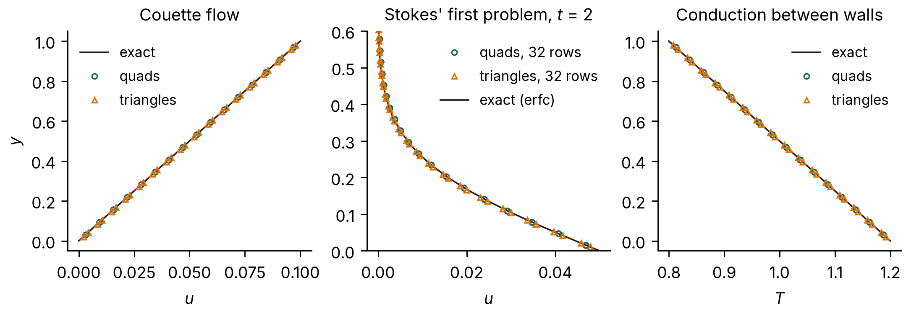{ loading=lazy width=2158 height=748 }
<figcaption>Couette flow and conduction on 16 rows of cells, Stokes' first problem on 32 rows, against the exact solutions.</figcaption>
</figure>

On quadrilaterals the linear Couette and conduction profiles are reproduced to round-off (largest error 1e-13 of U and 5e-14 of the temperature difference); on triangles the largest errors are 7.44 × 10−7 of U and 1.03 × 10−5 of the temperature difference. For Stokes' first problem, the largest velocity error relative to U:

| Rows | Quadrilaterals | rate | Triangles | rate |
|---:|---:|---:|---:|---:|
| 16 | 6.56 × 10−3 |  | 5.19 × 10−3 |  |
| 32 | 1.58 × 10−3 | 2.05 | 1.38 × 10−3 | 1.92 |
| 64 | 3.97 × 10−4 | 2.00 | 3.51 × 10−4 | 1.97 |
| 128 | 9.94 × 10−5 | 2.00 | 9.27 × 10−5 | 1.92 |

The viscous terms converge at second order on quadrilaterals and at 1.9 to 2.0 on these right triangles (0.0093% of U at 128 rows). With Mallard 0.2.0, on strips only 4 cells wide, the triangle error stalled near 0.4% of U. That came from the transmissive ends of the strip, not from the interior scheme: the viscous fluxes on triangles next to transmissive boundaries, which Mallard 0.3.0 makes second-order, and a one-sided gradient at those ends, which dominates when the strip narrows with refinement. The strip now keeps a fixed width of 0.25.

## Cylinder at Re = 100 {#cylinder-at-re-100}

Viscous flow past a circular cylinder at Re = U D / ν = 100 and Mach 0.2, the [`cylinder`](docs/examples.md) example: an O-grid of 384 × 128 quadrilaterals reaching 25 D, first cell 0.01 D, generated with `tools/make_cylinder_mesh.py`. Adiabatic no-slip wall, characteristic far field, third-order TENO-E, HLLC, SSPRK3 at CFL 0.8, run to t U / D = 80. Shedding is fully developed by t U / D = 12, and the statistics are taken over the ten complete lift cycles after that.

<figure class="mallard-figure" markdown>
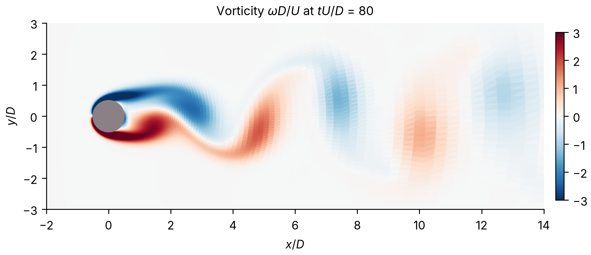{ loading=lazy width=1921 height=830 }
<figcaption>Vorticity at t U / D = 80.</figcaption>
</figure>

<figure class="mallard-figure" markdown>
Drag and lift on both meshes, with the averaging window shaded and the means of Johnson & Patel (1999) dashed; the finer run starts from the coarser at t U / D ≈ 49.

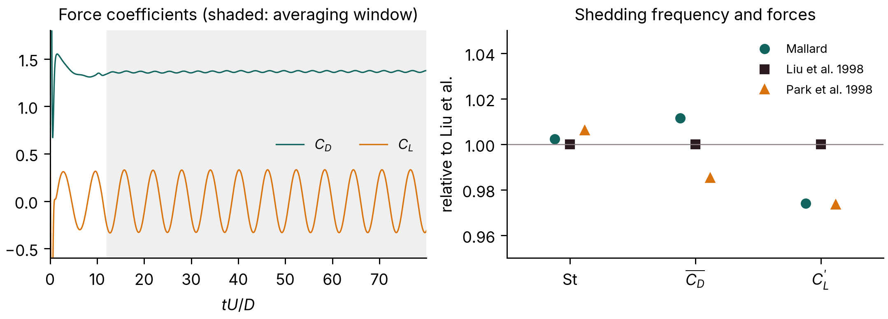{ loading=lazy width=2158 height=778 }
<figcaption>Left: drag and lift coefficients. Right: Strouhal number, mean drag and lift amplitude relative to Liu et al. (1998).</figcaption>
</figure>

| Source | St | mean CD | CD amplitude | CL amplitude |
|---|---:|---:|---:|---:|
| Mallard, 384 × 128 | 0.1651 | 1.368 | 0.015 | 0.331 |
| Mallard, 768 × 256, first cell 0.005 D | 0.1651 | 1.365 | 0.016 | 0.330 |
| Liu, Zheng & Sung (1998) | 0.164 | 1.350 | 0.012 | 0.339 |
| Park, Kwon & Choi (1998) | 0.165 | 1.33 | | 0.33 |
| Williamson (1996), experiment | 0.164 | | | |

The references are incompressible computations (Liu et al., Park et al.) and experiments (Williamson); Mallard's run is compressible at Mach 0.2. On a mesh refined by a factor of two in each direction (768 × 256 cells, first cell 0.005 D, run to t U / D = 60: seven lift cycles) the Strouhal number does not change (to 0.01%), and the mean drag and lift amplitude change by 0.2% and 0.4%.

## Viscous shock tube {#viscous-shock-tube}

The viscous shock tube of Daru & Tenaud (2009) at Re = 200: a diaphragm at x = 0.5 in a closed unit box releases a Mach 2.37 shock (density ratio 100) that reflects off the end wall and interacts with the boundary layer it has laid down on the floor, forming a lambda shock and a primary vortex by t = 1. The [`viscous_shock_tube`](docs/examples.md) example computes the lower half, [0, 1] × [0, 0.5], on 1000 × 500 quadrilaterals with no-slip adiabatic walls and a symmetry plane on top; Navier–Stokes, Pr = 0.73, fifth-order TENO-E, HLLC, SSPRK3 at CFL 0.8 (about 58,500 time steps, limited by viscosity). The reference is the grid-converged solution of Zhou et al. (2018) on 1500 × 750 cells.

<figure class="mallard-figure" markdown>
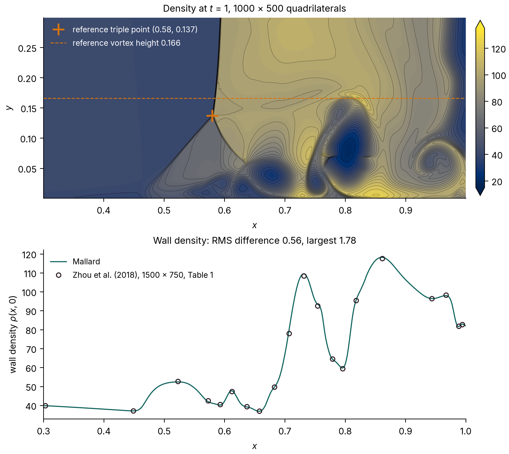{ loading=lazy width=2157 height=1925 }
<figcaption>Viscous shock tube at t = 1 on 1000 × 500 quadrilaterals. Top: density near the floor with the reference triple point and primary-vortex height. Bottom: density in the first row of cells against the tabulated wall density of Zhou et al. (2018).</figcaption>
</figure>

| Quantity | Mallard, 1000 × 500 | Zhou et al., 1500 × 750 (Table 1) |
|---|---:|---:|
| Lambda-shock triple point (x, y) | (0.581, 0.138) | (0.58, 0.137) |
| Wall density minimum, at x | 36.90, 0.6575 | 36.96, 0.6577 |
| Wall density maximum, at x | 118.19, 0.8605 | 117.65, 0.8617 |
| Wall density, RMS difference at the 20 tabulated points | 0.56 | |
| Wall density, largest difference | 1.78 (at x = 0.707, on the steep rise to the second peak) | |

The triple point is the intersection of straight-line fits to the density-gradient ridges of the lambda's front leg and the reflected shock above it. The wall density varies from 37 to 118 along the floor, so the RMS difference is 0.7% of that range. On a mesh coarsened by a factor of two in each direction (500 × 250) the RMS difference is 2.21, the largest 7.33, and the triple point is at (0.580, 0.140): the solution converges toward the reference with the mesh.

## 3D cases {#3d-cases}

The cases below use Mallard's 3D build (`-DMallard_DIM=3`). See [a 3D case](docs/tutorial.md#6-a-3d-case) for how to build and run in 3D.

### Sod shock tube in 3D {#sod-3d}

The Sod problem of the [Sod shock tube](#sod-shock-tube) section on a 200 × 4 × 4 box of hexahedra with slip walls on all six faces, MUSCL with the Venkatakrishnan limiter, HLLC, SSPRK3. The solution stays one-dimensional to round-off (transverse velocities below 10−13), and its L1 density error against the exact solution, 2.653 × 10−3, equals that of the same scheme on 200 × 4 quadrilaterals in 2D to all four digits.

### Spherical explosion {#spherical-explosion}

The spherical explosion of Toro (*Riemann Solvers and Numerical Methods for Fluid Dynamics*, 3rd ed., §17.1.3), the [`explosion_3d`](docs/examples.md#explosion-3d) example: a sphere of radius 0.4 at ρ = 1, p = 1 in a gas at ρ = 0.125, p = 0.1, run to t = 0.25. One octant, [0, 1]³, is computed on 64³ hexahedra with symmetry planes at x, y, z = 0 and transmissive outer faces; fifth-order TENO-E, HLLC, SSPRK3. The reference is a solution of the radial Euler equations (fifth-order WENO on 4000 cells), from the validation scripts.

<figure class="mallard-figure" markdown>
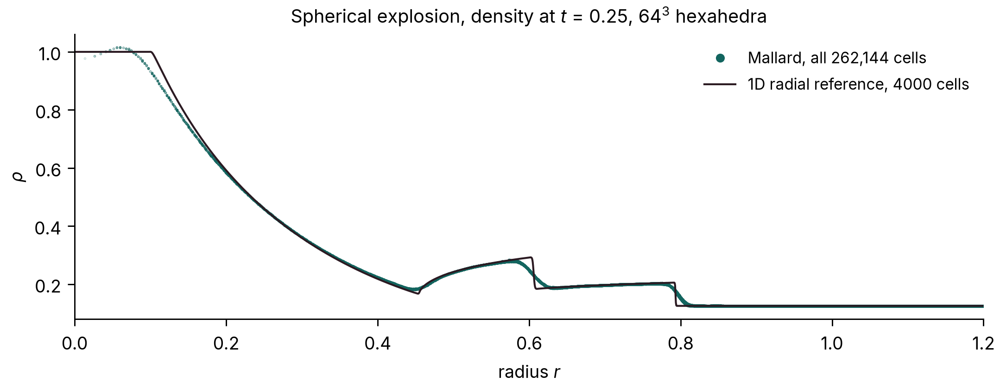{ loading=lazy width=2158 height=838 }
<figcaption>Density at t = 0.25 of all 262,144 cells against their distance from the center, and the radial reference: the rarefaction running into the center, the contact near r = 0.6 and the shock near r = 0.8.</figcaption>
</figure>

The cells collapse onto one curve, so the computed flow stays spherically symmetric on the Cartesian mesh, and that curve follows the reference: the mean absolute difference in density is 0.004 (cells with r < 0.95), most of it at the discontinuities, which the 64³ mesh spreads over two to three cells. Mallard 0.4.0 reproduces the 0.3.0 run bit for bit.

### Sedov–Taylor blast wave {#sedov-taylor}

A point explosion in a gas at rest (Taylor 1950; Sedov 1959), the `sedov_3d` example (new in Mallard 0.4.0): the energy is deposited in a small sphere at the origin, and only the octant x, y, z ≥ 0 is computed, with three symmetry planes, on 128³ hexahedra (2,097,152 cells); fifth-order TENO-E with bound-preserving scaling, HLLC, SSPRK3, to t = 0.8, on A100 GPUs, run with the development code between 0.3.0 and 0.4.0 (0.4.0's changes to TENO-E leave results on hexahedra bitwise the same). The exact similarity solution for γ = 1.4 puts the shock at R = ξ0(E t²/ρ0)1/5 with ξ0 = 1.0328.

<figure class="mallard-figure" markdown>
<video data-autoplay controls loop muted playsinline preload="none" width="1920" height="1080" poster="../media/sedov_poster.jpg" aria-label="Density of the Sedov-Taylor blast wave on three symmetry planes, with the shock radius and density profile against the exact similarity solution"><source src="../media/sedov.mp4" type="video/mp4"></video>
<figcaption>Density on the three symmetry planes, the shock radius against the similarity solution, and the density of the cells on the planes against the exact profile.</figcaption>
</figure>

| t | 0.1 | 0.2 | 0.4 | 0.6 | 0.8 |
|---|---:|---:|---:|---:|---:|
| Shock radius, error against the similarity solution | +2.6% | +1.9% | +1.5% | +1.2% | +1.1% |

The shock-radius error decays as the run forgets the finite radius of the initial blast. The density profile follows the exact curve, with the peak behind the shock smeared to 4.2 (averaged over the shell) against 6 at this resolution, and varies by 2.5% over the shell at the peak; mass is conserved to round-off.

### Taylor–Green vortex at Re = 1600 {#taylor-green-vortex}

The Taylor–Green vortex is the standard test of a scheme's resolution of transition and decaying turbulence (case C3.5 of the International Workshop on High-Order CFD Methods; Brachet et al. 1983): in the periodic box [0, 2π]³, the velocity u = sin x cos y cos z, v = −cos x sin y cos z, w = 0 rolls up, breaks down into small vortices and decays, at Re = V0L/ν = 1600, Mach 0.1 and Pr = 0.71. Mallard computes the full periodic box (`examples/taylor_green_3d/input_periodic.toml`) on 128³ hexahedra (2,097,152 cells) with fifth-order TENO-E, HLLC and SSPRK3 at CFL 0.8, with the defaults of Mallard 0.3.0, which include the low-Mach correction of the convective flux, to t = 20 (run with the development code shortly after 0.3.0; 0.4.0 gives the same results on hexahedra): 32,274 time steps, 1 h 18 min on 8 NVIDIA A100 GPUs. The reference is the workshop's 512³ pseudo-spectral DNS. The resolved dissipation 2μΩ is computed from the enstrophy of the TENO-E reconstruction polynomials' velocity gradients.

<figure class="mallard-figure" markdown>
<video data-autoplay controls loop muted playsinline preload="none" width="1920" height="1080" poster="../media/tgv_poster.jpg" aria-label="Q-criterion isosurfaces of the Taylor-Green vortex in the full periodic box colored by vorticity magnitude, beside the dissipation rate against the spectral DNS"><source src="../media/tgv.mp4" type="video/mp4"></video>
<figcaption>Q-criterion isosurfaces colored by vorticity magnitude in the full periodic box, and the dissipation rate against the 512³ spectral DNS.</figcaption>
</figure>

<figure class="mallard-figure" markdown>
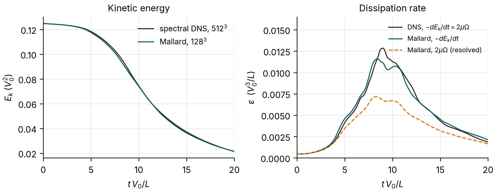{ loading=lazy width=2158 height=838 }
<figcaption>Mean kinetic energy, and the dissipation rate: −dEk/dt and the resolved part 2μΩ, against the 512³ spectral DNS, for which the two coincide.</figcaption>
</figure>

| t | 5 | 9 | 12 | 20 |
|---|---:|---:|---:|---:|
| Ek, Mallard 128³ | 0.1177 | 0.0847 | 0.0550 | 0.0213 |
| Ek, spectral DNS 512³ | 0.1184 | 0.0864 | 0.0544 | 0.0216 |

| | peak of −dEk/dt | at t | peak of 2μΩ | at t |
|---|---:|---:|---:|---:|
| Spectral DNS, 512³ | 0.01286 | 8.97 | 0.01286 | 8.97 |
| Mallard, 128³ | 0.01161 | 8.39 | 0.00719 | 8.28 |

The kinetic energy stays within 2.6% of the DNS through t = 20. Its dissipation rate peaks 10% low and 0.6 time units early. At its peak the resolved velocity gradients account for 56% of the DNS dissipation (2μΩ = 0.00719 against 0.01286): at this resolution the rest of the dissipation is numerical, supplied by the scheme in place of the scales the 128³ grid cannot represent.

### Mach 3 flow over a sphere {#mach-3-sphere}

Inviscid Mach 3 flow past a sphere of diameter D, started impulsively, the `sphere_mach3` example (new in Mallard 0.4.0): 796,962 tetrahedra in the quarter domain y, z ≥ 0 with two symmetry planes, refined on the sphere and through the shock layer; fifth-order TENO-E with bound-preserving scaling, HLL flux, SSPRK3, to t u∞/D = 3, on 4 GPUs. HLL rather than RHLL, because RHLL develops a carbuncle on the axis where the two symmetry planes meet ([issue #80](https://github.com/MatthewBonanni/mallard/issues/80)). This run used the development code before two 0.4.0 changes to TENO-E, the conditioning bound and complete stencils near boundaries ([#109](https://github.com/MatthewBonanni/mallard/pull/109)), which change results on tetrahedra; it has not been repeated with 0.4.0.

<figure class="mallard-figure" markdown>
<video data-autoplay controls loop muted playsinline preload="none" width="1920" height="1080" poster="../media/sphere_poster.jpg" aria-label="Mach number and schlieren of Mach 3 flow over a sphere, with the bow-shock standoff distance and stagnation-line pressure"><source src="../media/sphere.mp4" type="video/mp4"></video>
<figcaption>Mach number and schlieren on the two symmetry planes, the shock standoff distance against Billig's correlation, and the pressure along the stagnation line.</figcaption>
</figure>

| | Mallard | Reference |
|---|---:|---:|
| Shock standoff Δ/R | 0.226 | 0.205 (Billig 1967 correlation) |
| Stagnation pressure p0/p∞ | 12.0 | 12.06 (Rayleigh pitot formula) |
| Pressure drag coefficient | 0.95 | |

The standoff is steady from t u∞/D ≈ 1.2. It is 10% above Billig's empirical correlation, a difference of 0.01 D, under half the 0.025 D edge of the tetrahedra in the shock layer.

### Sphere at Re = 300 {#sphere-re300}

Viscous flow past a sphere at Re = U D / ν = 300 and Mach 0.2, the `sphere_re300` example (new in Mallard 0.4.0; run with 0.4.0's MUSCL, whose gradients on tetrahedra use vertex neighbours, [#111](https://github.com/MatthewBonanni/mallard/pull/111)). At this Reynolds number the wake sheds hairpin vortices periodically and keeps one plane of symmetry, so the sphere feels a mean lift as well as drag (Johnson & Patel 1999). The mesh, from `tools/make_sphere_re300_mesh.py`, has 10 layers of prisms on the sphere, from 0.005 D, and tetrahedra refined through the near wake, on the full box −15 < x/D < 30, |y|, |z| < 15. Navier–Stokes, MUSCL with HLLC, SSPRK3 at CFL 0.8; MUSCL rather than TENO-E, which is currently unstable on the thin boundary-layer prisms. The coefficients are averaged over the 7 shedding periods of t U / D = 90–150; the 0.85M-cell run took 4.7 h on 4 A100 GPUs, and the 2.06M-cell one, refined by 1.4 in every direction, 6.7 h on 8.

<figure class="mallard-figure" markdown>
<video data-autoplay controls loop muted playsinline preload="none" width="1920" height="1080" poster="../media/sphere_re300_poster.jpg" aria-label="Q-criterion isosurfaces of the hairpin vortices shed by a sphere at Re = 300, colored by streamwise velocity, with drag and lift histories"><source src="../media/sphere_re300.mp4" type="video/mp4"></video>
<figcaption>Q-criterion isosurfaces colored by streamwise velocity, and the drag and lift coefficients over time.</figcaption>
</figure>

| | St | mean CD | mean CL |
|---|---:|---:|---:|
| Mallard, 0.85M cells | 0.1331 | 0.6688 | 0.0731 |
| Mallard, 2.06M cells | 0.1328 | 0.6664 | 0.0697 |
| Johnson & Patel (1999) | 0.137 | 0.656 | 0.069 |
| Kim, Kim & Choi (2001) | 0.134 | 0.657 | 0.067 |
| Constantinescu & Squires (2003) | 0.136 | 0.655 | 0.065 |
| Tomboulides, Orszag & Karniadakis (1993) | 0.136 | 0.671 | |

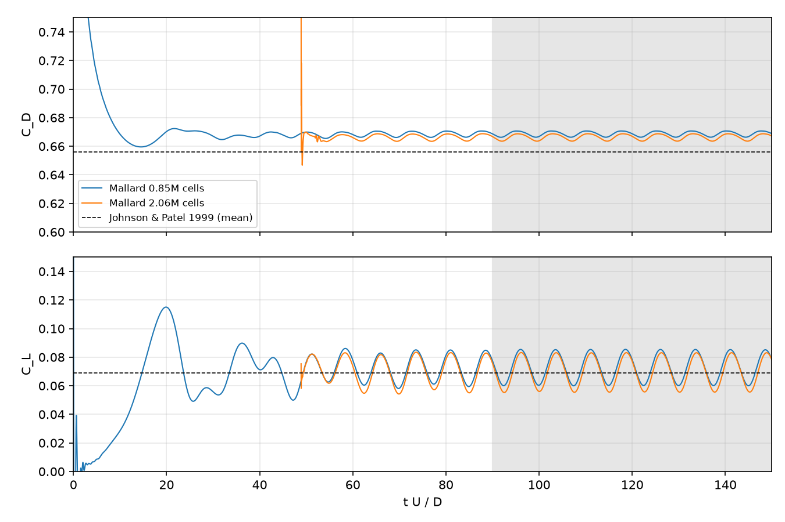{ loading=lazy width=1350 height=900 }

Refining the mesh by 1.4 in every direction changes the Strouhal number by 0.2%, the mean drag by 0.4% and the mean lift by 5%. On the finer mesh the Strouhal number is 1–3% below the references, the mean drag within the spread of the references (0.655 to 0.671), and the mean lift within 7% of them (0.065 to 0.069).

## References

The sources of the reference data and test cases on this page. The sources of the numerical methods themselves, with where Mallard uses each, are on the [References](docs/references.md) page.

- F. S. Billig, Shock-wave shapes around spherical- and cylindrical-nosed bodies, *J. Spacecraft Rockets* 4, 822–823 (1967). [doi:10.2514/3.28969](https://doi.org/10.2514/3.28969)
- M. E. Brachet, D. I. Meiron, S. A. Orszag, B. G. Nickel, R. H. Morf and U. Frisch, Small-scale structure of the Taylor–Green vortex, *J. Fluid Mech.* 130, 411–452 (1983).
- G. S. Constantinescu and K. D. Squires, LES and DES investigations of turbulent flow over a sphere at Re = 10,000, *Flow Turbul. Combust.* 70, 267–298 (2003). [doi:10.1023/B:APPL.0000004937.34078.71](https://doi.org/10.1023/B:APPL.0000004937.34078.71)
- V. Daru and C. Tenaud, Numerical simulation of the viscous shock tube problem by using a high resolution monotonicity-preserving scheme, *Computers & Fluids* 38, 664–676 (2009).
- T. A. Johnson and V. C. Patel, Flow past a sphere up to a Reynolds number of 300, *J. Fluid Mech.* 378, 19–70 (1999). [doi:10.1017/S0022112098003206](https://doi.org/10.1017/S0022112098003206)
- J. Kim, D. Kim and H. Choi, An immersed-boundary finite-volume method for simulations of flow in complex geometries, *J. Comput. Phys.* 171, 132–150 (2001). [doi:10.1006/jcph.2001.6778](https://doi.org/10.1006/jcph.2001.6778)
- C. Liu, X. Zheng and C. H. Sung, Preconditioned multigrid methods for unsteady incompressible flows, *J. Comput. Phys.* 139, 35–57 (1998).
- J. Park, K. Kwon and H. Choi, Numerical solutions of flow past a circular cylinder at Reynolds numbers up to 160, *KSME Int. J.* 12, 1200–1205 (1998).
- J. J. Quirk, A contribution to the great Riemann solver debate, *Int. J. Numer. Methods Fluids* 18, 555–574 (1994).
- L. I. Sedov, *Similarity and Dimensional Methods in Mechanics*, Academic Press (1959).
- C.-W. Shu, Essentially non-oscillatory and weighted essentially non-oscillatory schemes for hyperbolic conservation laws, in *Advanced Numerical Approximation of Nonlinear Hyperbolic Equations*, Lecture Notes in Mathematics 1697, 325–432 (1998).
- C.-W. Shu and S. Osher, Efficient implementation of essentially non-oscillatory shock-capturing schemes, II, *J. Comput. Phys.* 83, 32–78 (1989).
- G. A. Sod, A survey of several finite difference methods for systems of nonlinear hyperbolic conservation laws, *J. Comput. Phys.* 27, 1–31 (1978).
- G. I. Taylor, The formation of a blast wave by a very intense explosion. I. Theoretical discussion, *Proc. R. Soc. Lond. A* 201, 159–174 (1950). [doi:10.1098/rspa.1950.0049](https://doi.org/10.1098/rspa.1950.0049)
- A. G. Tomboulides, S. A. Orszag and G. E. Karniadakis, Direct and large-eddy simulation of the flow past a sphere, in *Engineering Turbulence Modelling and Experiments 2*, Elsevier, 273–282 (1993). [doi:10.1016/B978-0-444-89802-9.50030-7](https://doi.org/10.1016/B978-0-444-89802-9.50030-7)
- E. F. Toro, *Riemann Solvers and Numerical Methods for Fluid Dynamics*, 3rd ed., Springer (2009).
- C. H. K. Williamson, Vortex dynamics in the cylinder wake, *Annu. Rev. Fluid Mech.* 28, 477–539 (1996).
- G. Zhou, K. Xu and F. Liu, Grid-converged solution and analysis of the unsteady viscous flow in a two-dimensional shock tube, *Phys. Fluids* 30, 016102 (2018), [doi:10.1063/1.4998300](https://doi.org/10.1063/1.4998300); [arXiv:1705.09062](https://arxiv.org/abs/1705.09062).
