# Validation

Each result on this page comes from a run of Mallard (double precision, default settings, including the low-Mach correction of the convective flux, unless a section says otherwise), with the inputs described, compared with an exact solution, theory, or published reference data. The line under each heading, and the Version column below, give the release or commit that produced its numbers and figures; later releases change them only where a section says so. Most cases start from an input in Mallard's [examples](docs/examples.md); the scripts that ran every case and drew every figure are in the [website repository](https://github.com/MatthewBonanni/mallard-website/tree/main/validation). Mallard's test suite checks many of the same properties at smaller scale on every change. Mallard 0.5.0 changed two things that affect results: 2D cell centroids are now exact to round-off ([#127](https://github.com/MatthewBonanni/mallard/pull/127)), which keeps the Sod and Shu–Osher strips one-dimensional (both rerun with 0.5.0) and changes other 2D results at round-off level; and TENO-E ranks stencil candidates by the local mesh spacing on strongly stretched cells ([#120](https://github.com/MatthewBonanni/mallard/pull/120)), which leaves hexahedral and regular meshes unchanged. Cases marked 3D use Mallard's 3D build (`-DMallard_DIM=3`); see [a 3D case](docs/tutorial.md#6-a-3d-case) for how to build and run in 3D.

| Case | Quantity | Mallard | Reference | Version |
|---|---|---|---|---|
| [Isentropic vortex](#design-order-convergence) | order of accuracy, TENO-E orders 3–6 | 2.99, 4.02, 4.98, 6.03 (quads); 3.00, 4.01, 4.99, 5.99 (triangles) | 3, 4, 5, 6 | 0.3.0 |
| [Vortex across a periodic seam](#periodic-seams) | order of accuracy, TENO-E orders 3–6 | 2.91, 4.08, 4.87, 6.15 (quads); 2.98, 4.03, 4.94, 6.05 (triangles) | 3, 4, 5, 6 | 0.3.0 |
| [Sod shock tube](#sod-shock-tube) | L1 density error, 200 cells | 2.4 × 10−3 | exact solution | 0.5.0 |
| [Shu–Osher problem](#shu-osher-problem) | L1 density difference, 400 / 800 cells | 0.20 / 0.090 | WENO5 at 12,800 cells; WENO5 at the same resolution: 0.29 / 0.10 | 0.5.0 |
| [Spherical explosion](#spherical-explosion) (3D) | mean density difference, 64³ hexahedra | 0.004 | 1D radial solution, 4000 cells | 0.3.0 |
| [Sedov–Taylor blast wave](#sedov-taylor) (3D) | shock radius error at t = 0.8 | +1.1% | exact similarity solution | dev. 0.3.0–0.4.0 |
| [Shock–helium bubble](#shock-bubble) (3D) | refracted and transmitted shock, vortex ring, downstream interface velocities | 961, 359, 178, 166 m/s | Haas & Sturtevant (1987): 960, 365, 165, 165 m/s | dev. 0.5.0–0.6.0 |
| [Oblique shock](#oblique-shock) | shock angle, pressure ratio | 42.83°, 1.4985 (TENO-E) | 42.82°, 1.4984 (theory) | 0.4.0 |
| [Mach 3 sphere](#mach-3-sphere) (3D) | bow-shock standoff Δ/R; stagnation pressure | 0.226; 12.0 | 0.205 (Billig); 12.06 (pitot) | dev. 0.3.0–0.4.0 |
| [RHLL on the Mach 3 sphere](#mach-3-sphere-rhll) (3D) | shock on the axis / stagnation pressure, MUSCL, 796k tetrahedra | −0.6151 / 11.93 (before the fix: bulge to −0.624 / 10.6) | HLL: −0.6149 / 11.86 | 20239fc (after 0.7.0) |
| [Viscous exact solutions](#viscous-exact-solutions) | Stokes' first problem: order of accuracy, largest error at 128 rows | second order, 0.0099% of U (quads); order 1.9–2.0, 0.0093% of U (triangles) | exact solution | 0.3.0 |
| [Viscous shock tube](#viscous-shock-tube) | wall density RMS difference; lambda-shock triple point | 0.56 (range 37–118); (0.581, 0.138) | Zhou et al. (2018), 1500 × 750 grid: (0.58, 0.137) | 0.4.0 |
| [Cylinder, Re = 100](#cylinder-at-re-100) | St, mean CD, CL amplitude | 0.165, 1.368, 0.331 | 0.164–0.165, 1.33–1.35, 0.33–0.34 | not recorded |
| [Sphere, Re = 300](#sphere-re300) (3D) | St, mean CD, mean CL (2.06M cells) | 0.133, 0.666, 0.070 | 0.134–0.137, 0.655–0.671, 0.065–0.069 | dev. 0.3.0–0.4.0 |
| [Taylor–Green vortex, Re = 1600](#taylor-green-vortex) (3D) | peak dissipation rate, at t; largest ε error over t = 0.5–20, of the peak | 256³: 0.01289 at 8.83, 3.4%; 128³: 0.01161 at 8.39, 14.1% | 512³ spectral DNS: 0.01286 at 8.97 | dev. 0.6.0–0.7.0 |
| [Channel flow, Reτ = 180](#channel-retau180) (3D) | Reτ; Cf; peaks of urms, vrms, wrms, −u′v′ | 180.8; +2.0%; −0.5, +1.8, +1.4, +1.5% | DNS of Moser, Kim & Mansour (1999): 178.1 | dev. 0.6.0–0.7.0 |
| [Synthetic turbulent inflow](#synthetic-inflow) (3D) | distance from the inlet to within 5% of the developed channel, all statistics | about 17h | about 20h (Keating et al. 2004) | dev. 0.6.0–0.7.0 |
| [0D ignition](#ignition) (reacting) | ignition delay, 36 H2/air and CH4/air mixtures; final temperature | within 3 × 10−6 (H2), 2 × 10−4 (CH4); within 10−5 K | Cantera reactor; Cantera equilibrium | 0.4.0 |
| [Reactive shock tube](#reactive-shock-tube) (reacting) | reaction front at 230 µs, 50 / 25 / 12.5 µm cells | 99.63 / 99.66 / 99.66 mm | converged within one 50 µm cell | 0.4.0 |
| [CJ detonation](#detonation) (reacting) | front speed; induction length; peak pressure, at 10 / 20 / 40 cells per induction length | +0.11 / +0.01 / 0.00%; −4.5 / −1.8 / +2.7%; 174.8 / 175.2 / 174.7 kPa | DCJ 1616.9 m/s; ZND 1.525 mm; von Neumann 174.7 kPa | 0.4.0 |
| [Laminar flame speed](#flame-speed) (reacting) | H2/air, φ = 0.6–1.4, two transport models | within 0.81% | Cantera `FreeFlame` | 0.4.0 |
| [Laminar flame speed, CH4/air](#flame-speed-ch4) (reacting) | GRI-3.0, φ = 0.6–1.4, two transport models, 20 cells per thermal thickness | within 1.82% | Cantera `FreeFlame` | 040fb35 (after 0.6.0) |
| [Thermal diffusion (Soret)](#soret) (reacting) | change of the H2/air flame speed, φ = 0.5 / 1.0 | −7.23 / −8.26% | Cantera: −6.98 / −8.44% | caa9b4a (after 0.6.0) |
| [SIMPLER splitting](#simpler) (reacting) | detonation induction length vs ZND at CFL 1.0, 10 cells; Strang / SIMPLER | −25.5 / −0.9% | ZND 1.525 mm | beb3c3f (after 0.6.0) |
| [Cellular detonation](#cellular-detonation) (reacting, 2D) | front speed | 1617.0 m/s | DCJ 1616.9 m/s | dev. 0.3.0–0.4.0 |
| [Cellular detonation in 3D](#cellular-detonation-3d) (reacting) | front speed over 17 cm | 1620.6 m/s | DCJ 1617 m/s | dev. 0.5.0–0.6.0 |
| [Stratified autoignition](#autoignition) (reacting, 2D) | heat release peak time, T′ = 3.75 / 7.5 / 15 / 30 K | 0.993 / 0.986 / 0.952 / 0.822 τ0 | trend of Chen et al., Hawkes et al. (2006) (qualitative) | dev. 0.5.0–0.6.0 |
| [LES, decaying isotropic turbulence](#les-cbc) (3D) | log10 RMS spectral error at two stations, 128³, Sigma | 0.063 / 0.085 | Comte-Bellot & Corrsin (1971) | dev. after 0.5.0 |
| [LES, channel flow, Reτ = 395 / 590](#les-channel) (3D) | Reτ, Sigma with Scotti's width (64³ / 96³) | +0.7% / +1.6% | 392.2 / 587.2 (Moser, Kim & Mansour 1999) | dev. ~0.6.0–0.7.0 |
| [LES, thickened flame](#les-tfles) (reacting) | consumption speed at F = 7.9 / 31.6 | −0.2% / −0.2% | Cantera sL = 2.3324 m/s | dev. 0.6.0–0.7.0 |
| [LES, flame in turbulence](#les-flame) (reacting, 3D) | ST/SL, TFLES at Δ = 0.4 / 0.8 / 1.6 δL | 1.056 / 1.053 / 2.240 | DNS 1.132 | dev. 0.6.0–0.7.0 |
| [LES, non-premixed flame, PaSR](#les-pasr) (reacting, 3D, experimental) | heat release, Δ = 0.27 / 0.53 mm | −10.7% / −50% (quasi-laminar +16.6% / +41%) | DNS | dev. 0.6.0–0.7.0 |

## Order of accuracy {#accuracy}

Design order on smooth solutions, in 2D, including across periodic seams.

### Design-order convergence {#design-order-convergence}

Mallard 0.3.0 (0.4.0 changes these errors by at most 0.01%)
{ .mallard-provenance }

The isentropic vortex (Shu 1998) is an exact solution of the Euler equations: a vortex of strength β = 5 in a uniform stream (ρ, u, v, p) = (1, 1, 0.5, 1), γ = 1.4, translating without change of shape. It runs on [0, 14]² from (6.5, 6.75) to t = 1, with the exact moving solution imposed on all four boundaries (`dirichlet` conditions with expressions in x, y and t), on N × N quadrilaterals and on the same grids split into 2N² triangles, N = 28 to 448. TENO-E of orders 3 to 6, HLLC flux, RK4. The time step is 0.1 h for orders 3 and 4 and 0.1 h (h / h0)(p − 4)/4 for orders p = 5 and 6 (h0 = 1/2), so that the fourth-order time error falls at least as fast as the spatial error. The error is the area-weighted mean of |ρ − ρexact| over all cells, with the exact cell averages from a degree-5 quadrature on 16 sub-triangles of each triangle.

<figure class="mallard-figure" markdown>
{ loading=lazy width=2158 height=898 }
<figcaption>Mean density error of the isentropic vortex at t = 1 against the cell size h (the edge of the quadrilaterals, which the triangles split in two). Dashed lines have slopes 3 to 6.</figcaption>
</figure>

Every order converges at its design rate on both meshes: between the two finest grids the observed orders are 2.99, 4.02, 4.98 and 6.03 on quadrilaterals and 3.00, 4.01, 4.99 and 5.99 on triangles. On the coarsest grids, with only a few cells across the vortex core, the error has not yet reached its asymptotic rate. The maximum error converges at nearly the same rates (2.97 to 6.06 between the two finest grids). Mallard 0.4.0's changes to TENO-E next to boundaries move these errors by at most 0.01% from 0.3.0's.

**Quadrilaterals**

| h | order 3 | rate | order 4 | rate | order 5 | rate | order 6 | rate |
|---:|---:|---:|---:|---:|---:|---:|---:|---:|
| 1/2 | 1.79 × 10−3 |  | 5.99 × 10−4 |  | 8.41 × 10−4 |  | 5.22 × 10−4 |  |
| 1/4 | 4.28 × 10−4 | 2.06 | 6.88 × 10−5 | 3.12 | 1.33 × 10−4 | 2.66 | 3.15 × 10−5 | 4.05 |
| 1/8 | 6.96 × 10−5 | 2.62 | 3.85 × 10−6 | 4.16 | 5.90 × 10−6 | 4.50 | 5.56 × 10−7 | 5.82 |
| 1/16 | 9.15 × 10−6 | 2.93 | 2.24 × 10−7 | 4.10 | 1.97 × 10−7 | 4.90 | 8.15 × 10−9 | 6.09 |
| 1/32 | 1.15 × 10−6 | 2.99 | 1.38 × 10−8 | 4.02 | 6.23 × 10−9 | 4.98 | 1.25 × 10−10 | 6.03 |

**Triangles**

| h | order 3 | rate | order 4 | rate | order 5 | rate | order 6 | rate |
|---:|---:|---:|---:|---:|---:|---:|---:|---:|
| 1/2 | 6.61 × 10−4 |  | 2.48 × 10−4 |  | 4.67 × 10−4 |  | 1.36 × 10−4 |  |
| 1/4 | 1.18 × 10−4 | 2.48 | 1.57 × 10−5 | 3.98 | 3.32 × 10−5 | 3.81 | 3.45 × 10−6 | 5.30 |
| 1/8 | 1.58 × 10−5 | 2.90 | 8.70 × 10−7 | 4.17 | 1.21 × 10−6 | 4.78 | 5.59 × 10−8 | 5.95 |
| 1/16 | 1.99 × 10−6 | 2.99 | 5.24 × 10−8 | 4.05 | 3.89 × 10−8 | 4.96 | 8.69 × 10−10 | 6.01 |
| 1/32 | 2.48 × 10−7 | 3.00 | 3.26 × 10−9 | 4.01 | 1.22 × 10−9 | 4.99 | 1.36 × 10−11 | 5.99 |

#### Across periodic seams {#periodic-seams}

Mallard 0.3.0 (0.4.0 gives the same errors to seven digits)
{ .mallard-provenance }

Mallard 0.3.0 makes generated meshes periodic (`[mesh] periodic = ["x", "y"]`): the faces on opposite sides of the box become interior faces, and every stencil reaches across them. To check that the seam costs no accuracy, the same vortex runs in the doubly periodic box [0, 14]², starting centered 1 unit inside the right edge, so that it straddles the seam, and moving with (u, v) = (1, 0) to t = 2, through the seam to the other side. Initial data and the exact solution use the nearest periodic image; everything else is as above, on N = 28 to 224.

Between the two finest grids the observed orders are 2.91, 4.08, 4.87 and 6.15 on quadrilaterals and 2.98, 4.03, 4.94 and 6.05 on triangles: the design orders, as without the seam. Without boundaries, these runs are not affected by 0.4.0's changes to TENO-E next to walls: the errors are those of 0.3.0 to seven digits. Since 0.4.0, meshes read from Gmsh files can be periodic too, by pairing boundary zones in [`[[periodic]]`](docs/input.md#periodic) tables.

**Quadrilaterals, periodic**

| h | order 3 | rate | order 4 | rate | order 5 | rate | order 6 | rate |
|---:|---:|---:|---:|---:|---:|---:|---:|---:|
| 1/2 | 2.80 × 10−3 |  | 7.15 × 10−4 |  | 1.22 × 10−3 |  | 6.54 × 10−4 |  |
| 1/4 | 5.72 × 10−4 | 2.29 | 8.29 × 10−5 | 3.11 | 1.62 × 10−4 | 2.92 | 4.25 × 10−5 | 3.95 |
| 1/8 | 9.34 × 10−5 | 2.61 | 4.82 × 10−6 | 4.10 | 8.23 × 10−6 | 4.30 | 8.96 × 10−7 | 5.57 |
| 1/16 | 1.24 × 10−5 | 2.91 | 2.85 × 10−7 | 4.08 | 2.82 × 10−7 | 4.87 | 1.26 × 10−8 | 6.15 |

**Triangles, periodic**

| h | order 3 | rate | order 4 | rate | order 5 | rate | order 6 | rate |
|---:|---:|---:|---:|---:|---:|---:|---:|---:|
| 1/2 | 9.19 × 10−4 |  | 2.95 × 10−4 |  | 5.37 × 10−4 |  | 1.71 × 10−4 |  |
| 1/4 | 1.59 × 10−4 | 2.53 | 2.01 × 10−5 | 3.87 | 4.65 × 10−5 | 3.53 | 5.17 × 10−6 | 5.05 |
| 1/8 | 2.19 × 10−5 | 2.86 | 1.16 × 10−6 | 4.11 | 1.85 × 10−6 | 4.65 | 8.41 × 10−8 | 5.94 |
| 1/16 | 2.77 × 10−6 | 2.98 | 7.14 × 10−8 | 4.03 | 6.06 × 10−8 | 4.94 | 1.27 × 10−9 | 6.05 |

## Shock tubes and blast waves {#shocks}

Discontinuous solutions against exact or converged references, in 1D strips, 2D and 3D.

### Sod shock tube {#sod-shock-tube}

Mallard 0.5.0
{ .mallard-provenance }

The Riemann problem of Sod (1978): (ρ, u, p) = (1, 0, 1) for x < 0.5 and (0.125, 0, 0.1) for x > 0.5, γ = 1.4, at t = 0.2. The [`sod`](docs/examples.md) example: a strip of N × 4 square quadrilaterals with slip walls, HLLC flux, SSPRK3 at CFL 0.5. Run with Mallard 0.5.0.

<figure class="mallard-figure" markdown>
{ loading=lazy width=2158 height=718 }
<figcaption>Sod shock tube at t = 0.2 on 200 cells. Fifth-order TENO-E (dots) and MUSCL with the Venkatakrishnan limiter (line) against the exact solution.</figcaption>
</figure>

L1 error of the cell-averaged density, ∫|ρ − ρexact| dx, with the exact solution averaged over each cell, over all cells of the strip:

| Cells | TENO-E 5 | rate | MUSCL | rate |
|---:|---:|---:|---:|---:|
| 100 | 4.16 × 10−3 |  | 4.46 × 10−3 |  |
| 200 | 2.41 × 10−3 | 0.79 | 2.65 × 10−3 | 0.75 |
| 400 | 1.27 × 10−3 | 0.93 | 1.43 × 10−3 | 0.89 |
| 800 | 6.65 × 10−4 | 0.93 | 7.65 × 10−4 | 0.90 |

Both schemes converge at close to first order, the expected rate for a solution with a shock and a contact discontinuity; TENO-E has 7–13% lower error than MUSCL. The shock spans two cells and the contact discontinuity about five.

The errors are taken over all cells of the strip, whose four rows agree to round-off (5 × 10−14) at every resolution with Mallard 0.5.0. In 0.3.0 the rows next to the slip walls differed from the inner two, and the errors quoted here were those of the bottom row (3.92, 2.28, 1.21 and 0.60 × 10−3 for TENO-E); in 0.4.0 the TENO-E rows differed by up to 5 × 10−3 on 800 cells (error 7.24 × 10−4). MUSCL results are the same in all three versions.

#### Sod shock tube in 3D {#sod-3d}

Text: Mallard 0.3.0. Figure and table: rerun with Mallard 0.7.0
{ .mallard-provenance }

The Sod problem of the [Sod shock tube](#sod-shock-tube) section on a 200 × 4 × 4 box of hexahedra with slip walls on all six faces, MUSCL with the Venkatakrishnan limiter, HLLC, SSPRK3. The solution stays one-dimensional to round-off (transverse velocities below 10−13), and its L1 density error against the exact solution, 2.653 × 10−3, equals that of the same scheme on 200 × 4 quadrilaterals in 2D to all four digits.

<figure class="mallard-figure" markdown>
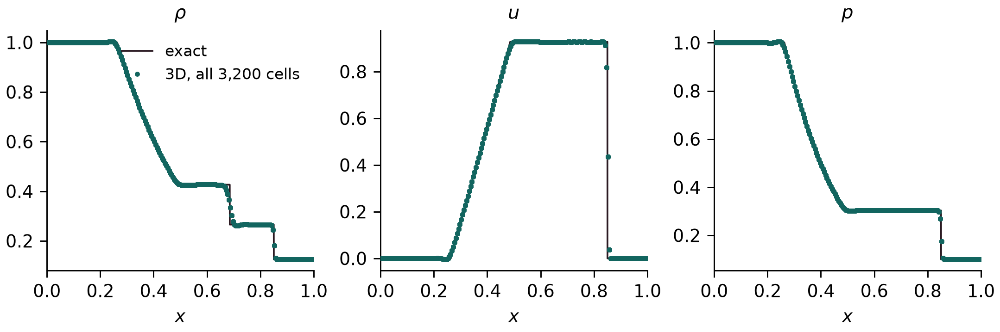{ loading=lazy width=2158 height=718 }
<figcaption>Every one of the 200 × 4 × 4 cells at t = 0.2 (MUSCL with the Venkatakrishnan limiter, HLLC), against the exact solution; Mallard 0.7.0.</figcaption>
</figure>

| Run | L1 density error | largest transverse velocity | largest density spread across a cross-section |
|---|---:|---:|---:|
| 3D, 200 × 4 × 4 hexahedra, Mallard 0.7.0 | 2.662 × 10−3 | 1.5 × 10−14 | 3.4 × 10−14 |
| 3D, the same, Mallard 0.3.0 | 2.653 × 10−3 | below 10−13 | |
| 2D, 200 × 4 quadrilaterals, Mallard 0.5.0 ([table above](#sod-shock-tube)) | 2.65 × 10−3 | | |

The 0.7.0 rerun uses the `sod` example's settings in 0.7.0 (CFL 1.0 in that release's time-step convention, [#175](https://github.com/MatthewBonanni/mallard/pull/175)); the solution stays one-dimensional to round-off.

### Shu–Osher problem {#shu-osher-problem}

Mallard 0.5.0
{ .mallard-provenance }

A Mach 3 shock running into a sinusoidal density field (Shu & Osher 1989), on [0, 10] (the usual [−5, 5] shifted by 5), t = 1.8, with the [`shu_osher`](docs/examples.md) example: fifth-order TENO-E and the RHLL flux on N × 4 square quadrilaterals, run with Mallard 0.5.0. There is no exact solution; the reference is a one-dimensional fifth-order WENO-JS solution (characteristic, Lax–Friedrichs flux splitting, SSPRK3) on 12,800 cells, which differs from the same code on 6,400 cells by 0.007 in L1.

<figure class="mallard-figure" markdown>
{ loading=lazy width=2158 height=778 }
<figcaption>Shu–Osher problem at t = 1.8: fifth-order TENO-E with the RHLL flux on 200 and 400 cells against the 12,800-cell reference. Right: the entropy waves generated behind the shock, the part of the solution that separates high-order schemes.</figcaption>
</figure>

L1 density difference from the reference, ∫|ρ − ρref| dx:

| Cells | Mallard, RHLL | Mallard, HLLC | 1D WENO5, same cells |
|---:|---:|---:|---:|
| 200 | 0.66 | 0.65 | 0.75 |
| 400 | 0.20 | 0.21 | 0.29 |
| 800 | 0.090 | 0.31 | 0.10 |
| 1600 | 0.043 | 0.65 | 0.048 |

With the rotated-hybrid RHLL flux, Mallard converges to the reference and is more accurate than the one-dimensional WENO5 scheme on every grid (0.3.0 had 0.26, 0.12 and 0.082 on 400, 800 and 1600 cells; 0.4.0 0.20, 0.11 and 0.059). With HLLC it does not converge beyond 400 cells: behind the Mach 3 shock, which moves along the grid lines of the strip, the rows of a problem that should stay one-dimensional differ by up to 1.1 in density on 800 and 1600 cells, and the entropy waves are lost. This is the grid-aligned shock instability that Quirk (1994) described for Roe's scheme and to which HLLC is also prone; use `RHLL` for strong shocks aligned with quadrilateral grids. The example has used RHLL since Mallard 0.3.0 (0.2.0's used HLLC). With RHLL the rows differ by up to 0.07 on 800 cells and 10−5 on 1600.

<figure class="mallard-figure" markdown>
{ loading=lazy width=1258 height=714 style="max-width: 32rem" }
<figcaption>Entropy waves on 1600 cells with the HLLC and RHLL fluxes.</figcaption>
</figure>

### Spherical explosion (3D) {#spherical-explosion}

Mallard 0.3.0 (0.4.0 reproduces it bit for bit)
{ .mallard-provenance }

The spherical explosion of Toro (*Riemann Solvers and Numerical Methods for Fluid Dynamics*, 3rd ed., §17.1.3), the [`explosion_3d`](docs/examples.md#explosion-3d) example: a sphere of radius 0.4 at ρ = 1, p = 1 in a gas at ρ = 0.125, p = 0.1, run to t = 0.25. One octant, [0, 1]³, is computed on 64³ hexahedra with symmetry planes at x, y, z = 0 and transmissive outer faces; fifth-order TENO-E, HLLC, SSPRK3. The reference is a solution of the radial Euler equations (fifth-order WENO on 4000 cells), from the validation scripts.

<figure class="mallard-figure" markdown>
{ loading=lazy width=2158 height=838 }
<figcaption>Density at t = 0.25 of all 262,144 cells against their distance from the center, and the radial reference: the rarefaction running into the center, the contact near r = 0.6 and the shock near r = 0.8.</figcaption>
</figure>

The cells collapse onto one curve, so the computed flow stays spherically symmetric on the Cartesian mesh, and that curve follows the reference: the mean absolute difference in density is 0.004 (cells with r < 0.95), most of it at the discontinuities, which the 64³ mesh spreads over two to three cells. Mallard 0.4.0 reproduces the 0.3.0 run bit for bit.

### Sedov–Taylor blast wave (3D) {#sedov-taylor}

Development code between 0.3.0 and 0.4.0 (commit not recorded; 0.4.0 is bitwise the same on hexahedra)
{ .mallard-provenance }

A point explosion in a gas at rest (Taylor 1950; Sedov 1959), the `sedov_3d` example (new in Mallard 0.4.0): the energy is deposited in a small sphere at the origin, and only the octant x, y, z ≥ 0 is computed, with three symmetry planes, on 128³ hexahedra (2,097,152 cells); fifth-order TENO-E with bound-preserving scaling, HLLC, SSPRK3, to t = 0.8, on A100 GPUs, run with the development code between 0.3.0 and 0.4.0 (0.4.0's changes to TENO-E leave results on hexahedra bitwise the same). The exact similarity solution for γ = 1.4 puts the shock at R = ξ0(E t²/ρ0)1/5 with ξ0 = 1.0328.

<figure class="mallard-figure" markdown>
<video data-autoplay controls loop muted playsinline preload="none" width="1920" height="1080" poster="../media/sedov_poster.jpg" aria-label="Density of the Sedov-Taylor blast wave on three symmetry planes, with the shock radius and density profile against the exact similarity solution"><source src="../media/sedov.mp4" type="video/mp4"></video>
<figcaption>Density on the three symmetry planes, the shock radius against the similarity solution, and the density of the cells on the planes against the exact profile.</figcaption>
</figure>

| t | 0.1 | 0.2 | 0.4 | 0.6 | 0.8 |
|---|---:|---:|---:|---:|---:|
| Shock radius, error against the similarity solution | +2.6% | +1.9% | +1.5% | +1.2% | +1.1% |

The shock-radius error decays as the run forgets the finite radius of the initial blast. The density profile follows the exact curve, with the peak behind the shock smeared to 4.2 (averaged over the shell) against 6 at this resolution, and varies by 2.5% over the shell at the peak; mass is conserved to round-off.

### Shock–helium bubble interaction (3D) {#shock-bubble}

Development code between 0.5.0 and 0.6.0: [`3bec90f`](https://github.com/MatthewBonanni/mallard/commit/3bec90f) with the tools of [#183](https://github.com/MatthewBonanni/mallard/pull/183)
{ .mallard-provenance }

A Mach 1.25 shock in air hits a helium bubble, the spherical case of Haas & Sturtevant (1987), in the [`shock_bubble_3d`](docs/examples.md#shock-bubble-3d) example. Navier–Stokes with mixture-averaged transport in He + N2/O2; the bubble holds 28% air, which gives a sound speed of 871.5 m/s (Haas & Sturtevant estimate 872). The gases, Mach number and tube are the experiment's in units of the bubble diameter D, but the bubble is scaled down to 0.18 mm, so Re = 1.5 × 103 instead of 3 × 105. The domain is a quarter of the square tube with symmetry planes, at 128 cells per D: 11.4 million hexahedra. The run took 52,091 steps, 3.4 hours on four A100 GPUs.

<figure class="mallard-figure" markdown>
<video data-autoplay controls loop muted playsinline preload="none" width="1920" height="1080" poster="../media/shock_bubble_3d_poster.jpg" aria-label="Helium surface and vortex ring of a shock-accelerated helium bubble, numerical schlieren on the symmetry plane and interface positions against Haas and Sturtevant"><source src="../media/shock_bubble_3d.mp4" type="video/mp4"></video>
<figcaption>The helium surface (Y = 0.15), and the vortex sheet and ring colored by helium fraction; numerical schlieren on the symmetry plane; positions on the axis against the measured velocities. Times and lengths at the experiment's scale.</figcaption>
</figure>

| Velocity [m/s] | Mallard, 128 cells per D | Haas & Sturtevant |
|---|---:|---:|
| refracted shock | 961 | 960 |
| transmitted shock | 359 | 365 |
| vortex ring | 178 | 165 |
| downstream interface, late | 166 | 165 |

All four are within 0–8% of the measurements, inside their 10% uncertainty, and within 1.2% of a run at 96 cells per D. The upstream interface, the air jet and the late upstream face move differently from the experiment. At this Reynolds number and a Péclet number of about 190, the trailing helium is drawn into the ring.

## Shocks on bodies {#shocks-on-bodies}

### Oblique shock (2D) {#oblique-shock}

Mallard 0.4.0 (MUSCL unchanged from 0.3.0)
{ .mallard-provenance }

Mach 1.758 flow (u = 600 m/s, T = 300 K, R = 277.4 J/(kg K)) over an 8° compression ramp, the [`wedge`](docs/examples.md) example: 160 × 120 quadrilaterals, HLLC, SSPRK3, run to t = 0.02 s (six flow-through times). The oblique-shock relations give a shock angle β = 42.816° and a pressure ratio p2/p1 = 1.4984. The measured angle is a straight-line fit to the half-jump pressure contour for 0.7 < x < 1.6 m; the pressure ratio is the mean over the cells 0.03–0.12 m above the ramp for 0.9 < x < 1.1 m.

<figure class="mallard-figure" markdown>
{ loading=lazy width=2136 height=808 }
<figcaption>Left: pressure with the theoretical shock (dashed). Right: pressure across the shock at x = 1.51 m with MUSCL and fifth-order TENO-E against the theoretical jump.</figcaption>
</figure>

| Source | Shock angle | Error | p2/p1 | Error |
|---|---:|---:|---:|---:|
| Theory | 42.816° | | 1.4984 | |
| MUSCL | 42.814° | −0.002° | 1.4984 | < 0.01% |
| TENO-E 5 | 42.826° | +0.011° | 1.4985 | +0.01% |

The fitted shock passes through x = 0.4997 m at y = 0, the ramp corner being at x = 0.5 m. MUSCL results are unchanged from Mallard 0.3.0; with 0.4.0's TENO-E changes next to walls, the TENO-E shock angle moved from 42.821° to 42.826°.

### Mach 3 flow over a sphere (3D) {#mach-3-sphere}

Development code between 0.3.0 and 0.4.0, before [#109](https://github.com/MatthewBonanni/mallard/pull/109) (commit not recorded)
{ .mallard-provenance }

Inviscid Mach 3 flow past a sphere of diameter D, started impulsively, the `sphere_mach3` example (new in Mallard 0.4.0): 796,962 tetrahedra in the quarter domain y, z ≥ 0 with two symmetry planes, refined on the sphere and through the shock layer; fifth-order TENO-E with bound-preserving scaling, HLL flux, SSPRK3, to t u∞/D = 3, on 4 GPUs. HLL rather than RHLL, because RHLL develops a carbuncle on the axis where the two symmetry planes meet ([issue #80](https://github.com/MatthewBonanni/mallard/issues/80)). This run used the development code before two 0.4.0 changes to TENO-E, the conditioning bound and complete stencils near boundaries ([#109](https://github.com/MatthewBonanni/mallard/pull/109)), which change results on tetrahedra; it has not been repeated with 0.4.0.

<figure class="mallard-figure" markdown>
<video data-autoplay controls loop muted playsinline preload="none" width="1920" height="1080" poster="../media/sphere_poster.jpg" aria-label="Mach 3 flow over a sphere: Mach number on the horizontal meridian, numerical schlieren on the vertical one and the revolved bow shock, with the standoff distance against Billig's correlation and the stagnation-line pressure"><source src="../media/sphere.mp4" type="video/mp4"></video>
<figcaption>Mach number on the horizontal meridian, numerical schlieren on the vertical one and the revolved bow shock; the shock standoff distance against Billig's correlation, and the pressure along the stagnation line.</figcaption>
</figure>

| | Mallard | Reference |
|---|---:|---:|
| Shock standoff Δ/R | 0.226 | 0.205 (Billig 1967 correlation) |
| Stagnation pressure p0/p∞ | 12.0 | 12.06 (Rayleigh pitot formula) |
| Pressure drag coefficient | 0.95 | |

The standoff is steady from t u∞/D ≈ 1.2. It is 10% above Billig's empirical correlation, a difference of 0.01 D, under half the 0.025 D edge of the tetrahedra in the shock layer.

#### RHLL on the Mach 3 sphere {#mach-3-sphere-rhll}

[`20239fc`](https://github.com/MatthewBonanni/mallard/commit/20239fc) (merge of [#248](https://github.com/MatthewBonanni/mallard/pull/248), after Mallard 0.7.0)
{ .mallard-provenance }

With MUSCL on tetrahedra, the rotated-hybrid RHLL flux grew a carbuncle on the bow shock. On faces that cross the shock at an angle, its rotation turned the HLL part onto the shock normal instead of the face normal. Since [#248](https://github.com/MatthewBonanni/mallard/pull/248), RHLL blends the rotated flux toward HLL along the face normal by the pressure jump across the face, w = min(pl/pr, pr/pl)3. Contacts and shear layers have no pressure jump, so they keep the rotated flux. Inviscid Mach 3 flow over the sphere with MUSCL, at t = 2, gives the shock position on the axis and the stagnation pressure:

| Mesh | RHLL before the fix | RHLL with the fix | HLL |
|---|---:|---:|---:|
| quarter sphere, 121k tetrahedra | carbuncle: −0.687 / 9.0 at t = 1.2 | −0.6086 / 11.62 | −0.6087 / 11.71 |
| full sphere, 475k tetrahedra | −0.630 / 9.1 | −0.6163 / 12.04 | −0.6163 / 12.11 |
| example mesh, 796k tetrahedra (quarter) | bulges to −0.624 / 10.6 at t = 1.2–1.4 | −0.6151 / 11.93, steady | −0.6149 / 11.86 |

With the fix, RHLL matches HLL's shock position to 10−4 D. With TENO5 on the example mesh it gives −0.6157 to t = 1.8, as before the fix. Results of the other Riemann solvers are unchanged.

## Viscous flow {#viscous-flow}

### Viscous exact solutions {#viscous-exact-solutions}

Mallard 0.3.0
{ .mallard-provenance }

Three exact solutions of the compressible Navier–Stokes equations in a channel 0 < y < 1, computed on strips 0.25 wide of N/4 × N square cells (quadrilaterals, or the same split into triangles) with transmissive ends, μ constant, Pr = 0.72, R = 1, γ = 1.4, MUSCL reconstruction (Venkatakrishnan limiter), HLLC, SSPRK3 at CFL 0.8:

- **Couette flow:** a wall at rest at y = 0 and a wall moving at U = 0.1 at y = 1, both isothermal at T = 1, μ = 0.2, run to steady state (t = 15). Exact: u = U y.
- **Stokes' first problem:** a wall started impulsively at U = 0.05 under fluid at rest, ν = 0.01, a symmetry plane at y = 1, t = 2. Exact: u = U erfc(y / 2√(νt)).
- **Conduction:** walls at rest at T = 1.2 and T = 0.8, μ = 0.2, steady state (t = 20). Exact: T = 1.2 − 0.4 y.

<figure class="mallard-figure" markdown>
{ loading=lazy width=2158 height=748 }
<figcaption>Couette flow and conduction on 16 rows of cells, Stokes' first problem on 32 rows, against the exact solutions.</figcaption>
</figure>

On quadrilaterals the linear Couette and conduction profiles are reproduced to round-off (largest error 1e-13 of U and 5e-14 of the temperature difference); on triangles the largest errors are 7.44 × 10−7 of U and 1.03 × 10−5 of the temperature difference. For Stokes' first problem, the largest velocity error relative to U:

| Rows | Quadrilaterals | rate | Triangles | rate |
|---:|---:|---:|---:|---:|
| 16 | 6.56 × 10−3 |  | 5.19 × 10−3 |  |
| 32 | 1.58 × 10−3 | 2.05 | 1.38 × 10−3 | 1.92 |
| 64 | 3.97 × 10−4 | 2.00 | 3.51 × 10−4 | 1.97 |
| 128 | 9.94 × 10−5 | 2.00 | 9.27 × 10−5 | 1.92 |

The viscous terms converge at second order on quadrilaterals and at 1.9 to 2.0 on these right triangles (0.0093% of U at 128 rows). With Mallard 0.2.0, on strips only 4 cells wide, the triangle error stalled near 0.4% of U. That came from the transmissive ends of the strip, not from the interior scheme: the viscous fluxes on triangles next to transmissive boundaries, which Mallard 0.3.0 makes second-order, and a one-sided gradient at those ends, which dominates when the strip narrows with refinement. The strip now keeps a fixed width of 0.25.

### Viscous shock tube (2D) {#viscous-shock-tube}

Mallard 0.4.0
{ .mallard-provenance }

The viscous shock tube of Daru & Tenaud (2009) at Re = 200: a diaphragm at x = 0.5 in a closed unit box releases a Mach 2.37 shock (density ratio 100) that reflects off the end wall and interacts with the boundary layer it has laid down on the floor, forming a lambda shock and a primary vortex by t = 1. The [`viscous_shock_tube`](docs/examples.md) example computes the lower half, [0, 1] × [0, 0.5], on 1000 × 500 quadrilaterals with no-slip adiabatic walls and a symmetry plane on top; Navier–Stokes, Pr = 0.73, fifth-order TENO-E, HLLC, SSPRK3 at CFL 0.8 (about 58,500 time steps, limited by viscosity). The reference is the grid-converged solution of Zhou et al. (2018) on 1500 × 750 cells.

<figure class="mallard-figure" markdown>
{ loading=lazy width=2157 height=1925 }
<figcaption>Viscous shock tube at t = 1 on 1000 × 500 quadrilaterals. Top: density near the floor with the reference triple point and primary-vortex height. Bottom: density in the first row of cells against the tabulated wall density of Zhou et al. (2018).</figcaption>
</figure>

| Quantity | Mallard, 1000 × 500 | Zhou et al., 1500 × 750 (Table 1) |
|---|---:|---:|
| Lambda-shock triple point (x, y) | (0.581, 0.138) | (0.58, 0.137) |
| Wall density minimum, at x | 36.90, 0.6575 | 36.96, 0.6577 |
| Wall density maximum, at x | 118.19, 0.8605 | 117.65, 0.8617 |
| Wall density, RMS difference at the 20 tabulated points | 0.56 | |
| Wall density, largest difference | 1.78 (at x = 0.707, on the steep rise to the second peak) | |

The triple point is the intersection of straight-line fits to the density-gradient ridges of the lambda's front leg and the reflected shock above it. The wall density varies from 37 to 118 along the floor, so the RMS difference is 0.7% of that range. On a mesh coarsened by a factor of two in each direction (500 × 250) the RMS difference is 2.21, the largest 7.33, and the triple point is at (0.580, 0.140): the solution converges toward the reference with the mesh.

### Cylinder at Re = 100 (2D) {#cylinder-at-re-100}

Version not recorded: rerun with Mallard 0.3.0, with the force amplitudes and figures updated at the 0.5.0 site update
{ .mallard-provenance }

Viscous flow past a circular cylinder at Re = U D / ν = 100 and Mach 0.2, the [`cylinder`](docs/examples.md) example: an O-grid of 384 × 128 quadrilaterals reaching 25 D, first cell 0.01 D, generated with `tools/make_cylinder_mesh.py`. Adiabatic no-slip wall, characteristic far field, third-order TENO-E, HLLC, SSPRK3 at CFL 0.8, run to t U / D = 80. Shedding is fully developed by t U / D = 12, and the statistics are taken over the ten complete lift cycles after that.

<figure class="mallard-figure" markdown>
{ loading=lazy width=1921 height=830 }
<figcaption>Vorticity at t U / D = 80.</figcaption>
</figure>

<figure class="mallard-figure" markdown>
Drag and lift on both meshes, with the averaging window shaded and the means of Johnson & Patel (1999) dashed; the finer run starts from the coarser at t U / D ≈ 49.

{ loading=lazy width=2158 height=778 }
<figcaption>Left: drag and lift coefficients. Right: Strouhal number, mean drag and lift amplitude relative to Liu et al. (1998).</figcaption>
</figure>

| Source | St | mean CD | CD amplitude | CL amplitude |
|---|---:|---:|---:|---:|
| Mallard, 384 × 128 | 0.1651 | 1.368 | 0.014 | 0.331 |
| Mallard, 768 × 256, first cell 0.005 D | 0.1651 | 1.365 | 0.015 | 0.330 |
| Liu, Zheng & Sung (1998) | 0.164 | 1.350 | 0.012 | 0.339 |
| Park, Kwon & Choi (1998) | 0.165 | 1.33 | | 0.33 |
| Williamson (1996), experiment | 0.164 | | | |

The references are incompressible computations (Liu et al., Park et al.) and experiments (Williamson); Mallard's run is compressible at Mach 0.2. On a mesh refined by a factor of two in each direction (768 × 256 cells, first cell 0.005 D, run to t U / D = 60: seven lift cycles) the Strouhal number does not change (to 0.01%), and the mean drag and lift amplitude change by 0.2% and 0.4%.

### Sphere at Re = 300 (3D) {#sphere-re300}

Forces: development code before 0.4.0, with 0.4.0's MUSCL ([#111](https://github.com/MatthewBonanni/mallard/pull/111); commit not recorded). Animation: rerun between 0.5.0 and 0.6.0 for [#139](https://github.com/MatthewBonanni/mallard/pull/139)
{ .mallard-provenance }

Viscous flow past a sphere at Re = U D / ν = 300 and Mach 0.2, the `sphere_re300` example (new in Mallard 0.4.0; run with 0.4.0's MUSCL, whose gradients on tetrahedra use vertex neighbours, [#111](https://github.com/MatthewBonanni/mallard/pull/111)). At this Reynolds number the wake sheds hairpin vortices periodically and keeps one plane of symmetry, so the sphere feels a mean lift as well as drag (Johnson & Patel 1999). The mesh, from `tools/make_sphere_re300_mesh.py`, has 10 layers of prisms on the sphere, from 0.005 D, and tetrahedra refined through the near wake, on the full box −15 < x/D < 30, |y|, |z| < 15. Navier–Stokes, MUSCL with HLLC, SSPRK3 at CFL 0.8; MUSCL rather than TENO-E, which is currently unstable on the thin boundary-layer prisms. The coefficients are averaged over the 7 shedding periods of t U / D = 90–150; the 0.85M-cell run took 4.7 h on 4 A100 GPUs, and the 2.06M-cell one, refined by 1.4 in every direction, 6.7 h on 8.

<figure class="mallard-figure" markdown>
<video data-autoplay controls loop muted playsinline preload="none" width="1920" height="1080" poster="../media/sphere_re300_poster.jpg" aria-label="Q-criterion isosurfaces of the hairpin vortices shed by a sphere at Re = 300, colored by streamwise velocity, with drag and lift histories"><source src="../media/sphere_re300.mp4" type="video/mp4"></video>
<figcaption>Q-criterion isosurfaces colored by streamwise velocity, and the drag and lift coefficients over time.</figcaption>
</figure>

| | St | mean CD | mean CL |
|---|---:|---:|---:|
| Mallard, 0.85M cells | 0.1331 | 0.6688 | 0.0731 |
| Mallard, 2.06M cells | 0.1328 | 0.6664 | 0.0697 |
| Johnson & Patel (1999) | 0.137 | 0.656 | 0.069 |
| Kim, Kim & Choi (2001) | 0.134 | 0.657 | 0.067 |
| Constantinescu & Squires (2003) | 0.136 | 0.655 | 0.065 |
| Tomboulides, Orszag & Karniadakis (1993) | 0.136 | 0.671 | |

{ loading=lazy width=1350 height=900 }

Refining the mesh by 1.4 in every direction changes the Strouhal number by 0.2%, the mean drag by 0.4% and the mean lift by 5%. On the finer mesh the Strouhal number is 1–3% below the references, the mean drag within the spread of the references (0.655 to 0.671), and the mean lift within 7% of them (0.065 to 0.069).

## Turbulence {#turbulence}

Direct numerical simulations, all in 3D; the large-eddy simulations are in [their own section](#les).

### Taylor–Green vortex at Re = 1600 {#taylor-green-vortex}

256³: [`e90065d`](https://github.com/MatthewBonanni/mallard/commit/e90065d) (0.6.0 + 16 commits). 128³: development code shortly after Mallard 0.3.0 (version string 0.3.0; 0.4.0 is the same on hexahedra)
{ .mallard-provenance }

The Taylor–Green vortex is the standard test of a scheme's resolution of transition and decaying turbulence (case C3.5 of the International Workshop on High-Order CFD Methods; Brachet et al. 1983): in the periodic box [0, 2π]³, the velocity u = sin x cos y cos z, v = −cos x sin y cos z, w = 0 rolls up, breaks down into small vortices and decays, at Re = V0L/ν = 1600, Mach 0.1 and Pr = 0.71. Mallard computes the full periodic box (`examples/taylor_green_3d/input_periodic.toml`) with fifth-order TENO-E, HLLC and SSPRK3, including the low-Mach correction of the convective flux, to t = 20, at two resolutions:

- **256³** hexahedra (16.8 million cells), CFL 0.4: 65,162 time steps, 0.52 s per step on 14 NVIDIA A100 GPUs over four nodes (about 9.5 hours of stepping).
- **128³** hexahedra (2.1 million cells), CFL 0.8 with the defaults of Mallard 0.3.0: 32,274 time steps, 1 h 18 min on 8 A100 GPUs.

The reference is the workshop's 512³ pseudo-spectral DNS. The resolved dissipation 2μΩ is computed from the enstrophy of the TENO-E reconstruction polynomials' velocity gradients.

<figure class="mallard-figure" markdown>
<video data-autoplay controls loop muted playsinline preload="none" width="1920" height="1080" poster="../media/tgv_poster.jpg" aria-label="Q-criterion isosurfaces of the Taylor-Green vortex at 256 cubed colored by vorticity magnitude, beside the dissipation rate against the spectral DNS and the 128 cubed run"><source src="../media/tgv.mp4" type="video/mp4"></video>
<figcaption>256³: Q-criterion isosurfaces colored by vorticity magnitude in the full periodic box, and the dissipation rate traced over the 512³ spectral DNS and the 128³ run.</figcaption>
</figure>

<figure class="mallard-figure" markdown>
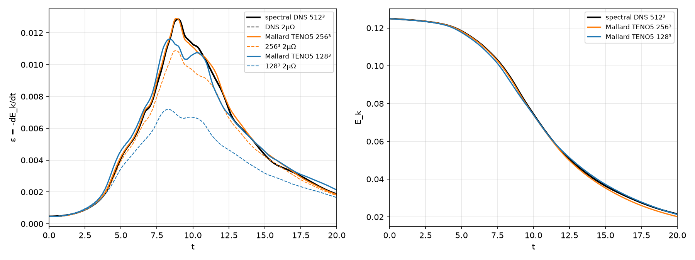{ loading=lazy width=1800 height=675 }
<figcaption>Dissipation rate −dEk/dt and its resolved part 2μΩ (left), and mean kinetic energy (right), at 256³ and 128³ against the 512³ spectral DNS.</figcaption>
</figure>

| | 512³ DNS | 256³ | 128³ |
|---|---:|---:|---:|
| peak of −dEk/dt, at t | 0.01286 at 8.97 | 0.01289 at 8.83 (+0.3%) | 0.01161 at 8.39 (−9.7%) |
| largest \|ε − εDNS\|, t = 0.5–20, over the DNS peak | | 3.4% | 14.1% |
| RMS ε error, over the DNS peak | | 1.2% | 4.0% |
| peak of the resolved 2μΩ | 0.01286 | 0.01087 (−15%) | 0.00719 (−44%) |
| Ek error, t ≤ 12 | | below 1% | up to 2.6% |
| Ek at t = 20 | 0.02157 | 0.02021 (−6.3%) | 0.02134 (−1.1%) |

- **Shape:** at 256³ the dissipation rate follows the DNS through its peak and the shoulder at t ≈ 10–11. At 128³ the peak is 10% low and 0.6 time units early, and the shoulder is lower.
- **Resolved and numerical dissipation:** the resolved part 2μΩ rises from 56% of the DNS peak at 128³ to 85% at 256³; the rest is numerical, supplied by the scheme in place of the scales the grid cannot represent.
- **Late decay:** 256³ dissipates slightly more than the DNS (ε within about 5% for t = 12–17), which accumulates to Ek 6% low at t = 20. The 128³ Ek at t = 20 is closer only because its under-dissipation near the peak compensates.

<figure class="mallard-figure" markdown>
{ loading=lazy width=2158 height=838 }
<figcaption>The 128³ run: mean kinetic energy, and the dissipation rate −dEk/dt and its resolved part 2μΩ, against the 512³ spectral DNS, for which the two coincide.</figcaption>
</figure>

| t | 5 | 9 | 12 | 20 |
|---|---:|---:|---:|---:|
| Ek, Mallard 128³ | 0.1177 | 0.0847 | 0.0550 | 0.0213 |
| Ek, spectral DNS 512³ | 0.1184 | 0.0864 | 0.0544 | 0.0216 |

### Turbulent channel flow, Reτ = 180 {#channel-retau180}

Example run: [`c7384ae`](https://github.com/MatthewBonanni/mallard/commit/c7384ae) (0.6.0 + 33 commits). The variants with the Riemann solver at every face: [`9de2a0e`](https://github.com/MatthewBonanni/mallard/commit/9de2a0e) (between 0.5.0 and 0.6.0)
{ .mallard-provenance }

Direct numerical simulation of turbulent channel flow at Reτ = 180, against the spectral DNS of Moser, Kim & Mansour (1999, MKM), the [`channel_retau180`](docs/examples.md#channel-retau180) example, with the kinetic-energy-preserving hybrid convective flux ([#205](https://github.com/MatthewBonanni/mallard/pull/205), [#216](https://github.com/MatthewBonanni/mallard/pull/216)). It uses MKM's box, 4πh × 2h × 4/3πh, periodic in x and z, between isothermal walls at bulk Mach 0.2. The mass flow is held at Reb = 5600, so Reτ is an outcome of the run. The mesh is 192 × 96 × 128 hexahedra (2.36 million), tanh-stretched in y: Δx+ = 11.8, Δz+ = 5.9, Δy+ = 0.88 at the wall. Navier–Stokes with no turbulence model. MUSCL states with the hybrid flux, which is the central KEEP flux everywhere except where the compression sensor calls the Riemann solver. Statistics are averaged over t = 120–320 h/Ub (12.9 h/uτ), with both halves of the channel folded. The run took 489,000 steps, 2.3 hours on two A100 GPUs.

<figure class="mallard-figure" markdown>
<video data-autoplay controls loop muted playsinline preload="none" width="1920" height="1080" poster="../media/channel_retau180_poster.jpg" aria-label="Q-criterion isosurfaces of the near-wall vortices of turbulent channel flow colored by streamwise velocity, over the velocity streaks at y+ = 11"><source src="../media/channel_retau180.mp4" type="video/mp4"></video>
<figcaption>Near-wall vortices (Q+ = 0.01, colored by streamwise velocity) over the low- and high-speed streaks at y+ = 11.</figcaption>
</figure>

<figure class="mallard-figure" markdown>
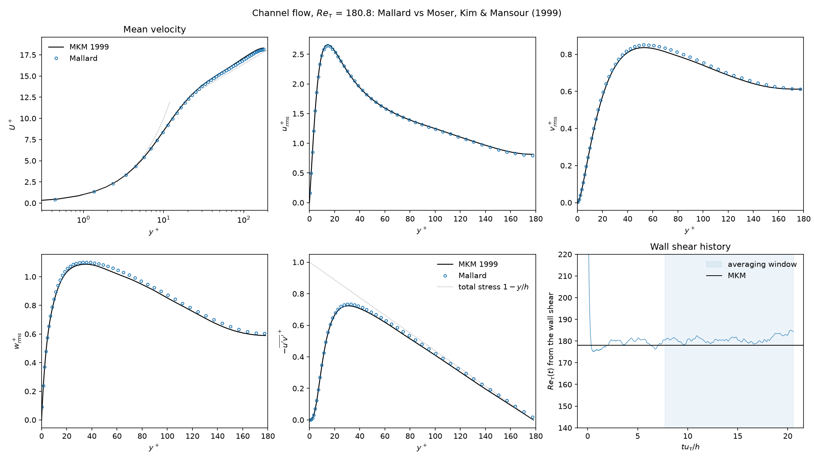{ loading=lazy width=2250 height=1275 }
<figcaption>Mean velocity, RMS velocity fluctuations and Reynolds shear stress in wall units against MKM, and Reτ(t) from the wall shear with the averaging window.</figcaption>
</figure>

| | Mallard | MKM | difference |
|---|---:|---:|---:|
| Reτ | 180.8 | 178.1 | +1.5% |
| Cf = 2τw / ρUb² | 0.00830 | 0.00814 | +2.0% |
| peak urms+ | 2.645 | 2.658 | −0.5% |
| peak vrms+ | 0.851 | 0.836 | +1.8% |
| peak wrms+ | 1.102 | 1.087 | +1.4% |
| peak −u′v′+ | 0.734 | 0.723 | +1.5% |

The kinetic-energy budget of `[integrals]` attributes 0.9% of the dissipation to the scheme and the rest to molecular viscosity. A second run, continued from a developed state and averaged over t = 365–560, reproduces these values to 0.5%. The mean momentum balance closes to 0.6% of τw.

The upwind dissipation of a Riemann solver at every face sets the friction. Each variant below starts from the same developed state and averages over 12 h/uτ ([#209](https://github.com/MatthewBonanni/mallard/issues/209)):

| Convective flux and mesh | Reτ | Cf vs MKM | peak urms+ |
|---|---:|---:|---:|
| HLLC, low-Mach correction (cutoff 0.1) | 172.9 | −6.8% | 2.894 |
| Roe | 171.9 | −7.9% | 2.913 |
| HLLC, low-Mach cutoff 0.01 | 173.9 | −5.8% | 2.872 |
| HLLC, low-Mach correction off | 157.1 | −23.0% | 3.343 |
| HLLC with TENO3 instead of MUSCL | 169.3 | −10.6% | 2.926 |
| HLLC, 384 × 96 × 128 (Δx+ 6) | 174.1 | −5.5% | 2.822 |
| HLLC, 192 × 96 × 256 (Δz+ 3) | 176.8 | −2.6% | 2.803 |
| HLLC, 384 × 96 × 256 | 178.4 | −0.8% | 2.716 |
| hybrid (KEEP central), continuation window | 181.0 | +2.1% | 2.648 |

On the example's mesh HLLC removes about 7% of the kinetic-energy dissipation, and the wall shear comes out 7% low. Without the low-Mach correction its dissipation is about five times larger in the core, and Cf is 23% low. HLLC reaches MKM, with vrms, wrms and −u′v′ within 2%, only with both Δx and Δz halved, at about five times the GPU time. Halving the time step changes nothing to 1%.

### Synthetic turbulent inflow {#synthetic-inflow}

[`f7d6571`](https://github.com/MatthewBonanni/mallard/commit/f7d6571) (0.6.0 + 77 commits, the branch of [#221](https://github.com/MatthewBonanni/mallard/pull/221))
{ .mallard-provenance }

A spatially developing channel at Reτ = 180 fed by synthetic turbulence, the [`channel_inflow_retau180`](https://github.com/MatthewBonanni/mallard/blob/main/examples/channel_inflow_retau180/input.toml) example ([#221](https://github.com/MatthewBonanni/mallard/pull/221)); the method is in [Design: synthetic turbulent inflow](docs/design/synthetic_inflow.md).

- **Inflow:** the `nscbc_inlet` takes its mean velocity and Reynolds stresses from the statistics of the [periodic channel](#channel-retau180). The digital filter of Klein, Sadiki & Janicka (2003) adds turbulence with those stresses, with integral lengths of 0.5h (streamwise velocity) and 0.1–0.2h otherwise.
- **Domain:** the periodic example's mesh twice as long, 8πh (384 × 96 × 128), with a sponge before the outlet beyond x = 20h.
- **Statistics:** averaged over t = 40–110 and over z, compared with the periodic channel at each x.
- **Cost:** 337,000 steps, 2.5 hours on four A100 GPUs. DNS, no turbulence model.

<figure class="mallard-figure" markdown>
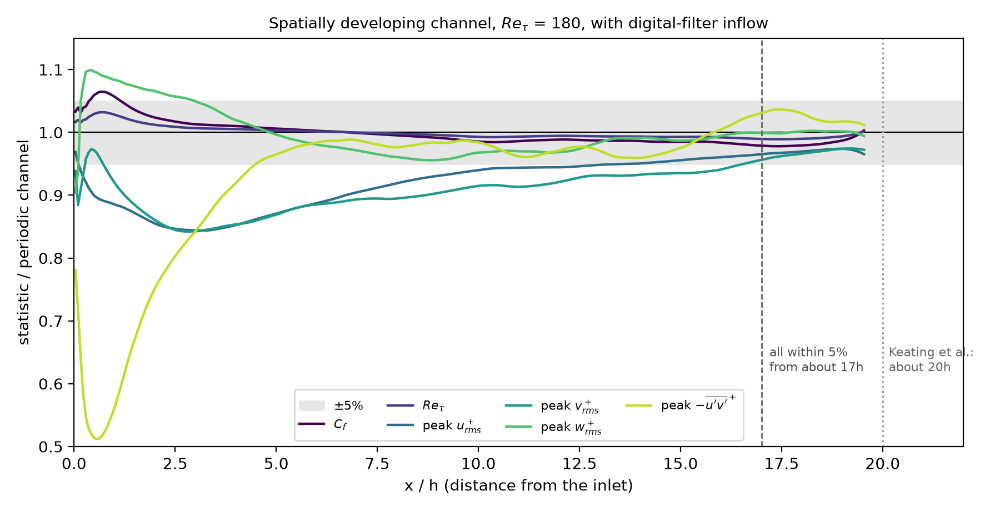{ loading=lazy width=1800 height=920 }
<figcaption>Wall shear, Reτ and the peaks of the Reynolds stresses along the channel, over their values in the periodic channel; the band is ±5%.</figcaption>
</figure>

| Statistic | within 5% of the periodic channel from |
|---|---:|
| Reτ | the inlet |
| Cf | 1.1h |
| peak wrms+ | 2.9h |
| peak −u′v′+ | 4.6h (57% of it at the inlet) |
| peak urms+ | 13.7h |
| peak vrms+ | 16.6h |

Every statistic is within 5% from about 17h; Keating et al. (2004) report about 20h for synthetic inflow into a channel. The shear stress recovers quickly because the full Reynolds-stress tensor and the precursor's mean profile are imposed. The normal stresses take longest: urms and vrms first dip to about 85% at x = 2–4h, as the inflow sheds its non-turbulent, dilatational part.

## Reacting flow {#reacting-flow}

Mallard 0.4.0 added thermally perfect gas mixtures and finite-rate chemistry: mechanisms in Cantera's YAML format, mixtures carried by the flow solver (MUSCL or TENO-E, optionally with double flux), kinetics with an analytical Jacobian integrated by a Rosenbrock method (RODAS), Strang splitting between chemistry and flow, and mixture-averaged, unity- or constant-Lewis-number transport; 0.5.0 runs the chemistry efficiently on GPUs ([performance](docs/performance.md#chemistry)). It is set up with `gas = "mixture"` in [`[physics]`](docs/input.md#physics) and the [`[chemistry]`](docs/input.md#chemistry) table. The design note on [finite-rate chemistry](docs/design/chemistry.md) explains the choices and the validation plan; the cases below are its V1, V2 and V6 to V8, and two 2D demonstrations, a cellular detonation and a lean hydrogen flame. They use the H2/O2 submechanism of GRI-Mech 3.0 with Ar and N2 (`mechanisms/h2o2.yaml`: 10 species, 29 reactions) or the full GRI-Mech 3.0 (53 species, 325 reactions), with the default chemistry tolerances (relative 10−6, absolute 10−10). The shock and detonation cases are inviscid; the flames include molecular transport.

### Ignition {#ignition}

Mallard 0.4.0
{ .mallard-provenance }

`MallardReactor`, a tool built with Mallard, integrates an adiabatic constant-volume reactor with the solver's chemistry kernels (the [`h2_ignition`](docs/examples.md#h2-ignition) example). It ran H2/air and CH4/air at T0 = 1000 to 1500 K, equivalence ratios φ = 0.5, 1 and 2 and 1 atm, 36 mixtures, against Cantera's `IdealGasReactor` with tolerances of 10−12, both sampled at the same 1500 times (1000 per ignition delay); the ignition delay is the time of the largest dT/dt.

<figure class="mallard-figure" markdown>
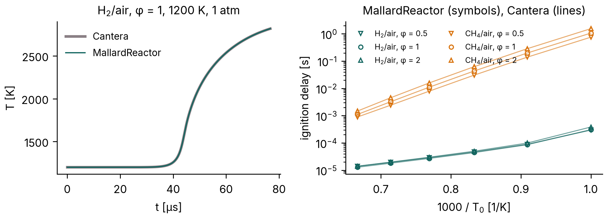{ loading=lazy width=2102 height=753 }
<figcaption>Left: temperature of stoichiometric H2/air from 1200 K and 1 atm. Right: ignition delays of the 36 mixtures.</figcaption>
</figure>

The ignition delays agree with Cantera's within 2.7 × 10−6 (relative) for H2/air and 1.8 × 10−4 for CH4/air, whose largest differences are at 1000 K, where ignition takes 0.9 to 1.6 s; from 1100 K up both are within 10−7. Run on to equilibrium (200 ignition delays for H2/air, 2 s for CH4/air), every reactor ends within 2 × 10−6 K of Cantera's constant-volume equilibrium temperature. Mallard's test suite repeats these comparisons, against stored Cantera data, on every change.

### Reactive shock tube {#reactive-shock-tube}

Mallard 0.4.0
{ .mallard-provenance }

The reactive shock tube of Fedkiw, Merriman & Osher (1997), studied in detail by Martínez Ferrer et al. (2014): in H2:O2:Ar = 2:1:7, a shock running into the closed end of a 12 cm tube reflects, the gas behind the reflected shock ignites, and the reaction front turns into a detonation that overtakes the reflected shock. The [`reactive_shock_tube`](docs/examples.md#reactive-shock-tube) example starts from the published states (p, T, u) = (7173 Pa, 378 K, 0) for x < 6 cm and (35,594 Pa, 748 K, −487 m/s) beyond, on 2400, 4800 and 9600 cells (50, 25 and 12.5 µm), with MUSCL, HLLC and SSPRK3 at CFL 0.5.

<figure class="mallard-figure" markdown>
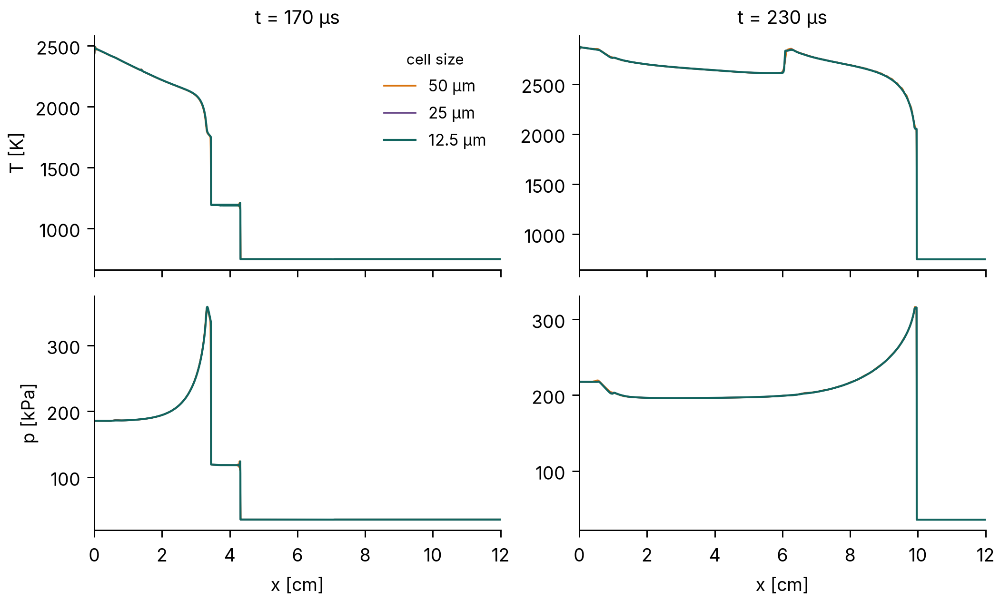{ loading=lazy width=2101 height=1263 }
<figcaption>Temperature and pressure at 170 µs, as the detonation forms behind the reflected shock, and at 230 µs, after it has overtaken it.</figcaption>
</figure>

| Cell size | Front at 170 µs | Front at 230 µs | Peak T at 230 µs | Peak p at 230 µs |
|---:|---:|---:|---:|---:|
| 50 µm | 33.23 mm | 99.63 mm | 2875.2 K | 316.6 kPa |
| 25 µm | 33.29 mm | 99.66 mm | 2876.1 K | 316.0 kPa |
| 12.5 µm | 33.33 mm | 99.66 mm | 2876.6 K | 315.7 kPa |

The front is the last cell above 1800 K. At 230 µs the three meshes put the detonation within one 50 µm cell of each other (99.625, 99.662 and 99.656 mm), and the peak temperature and pressure behind it change by less than 0.05% and 0.1% from 25 to 12.5 µm; at 170 µs the reaction front, still behind the reflected shock (near 4.3 cm), moves by 0.04 mm between the two finest meshes.

### CJ detonation {#detonation}

Mallard 0.4.0
{ .mallard-provenance }

A planar Chapman–Jouguet detonation in 2H2-O2-7Ar at 6.67 kPa and 298 K, the [`detonation_1d`](docs/examples.md#detonation-1d) example. With this mechanism the recombination zone behind the front is about 0.8 m long, so a detonation started by a driver gas runs below the CJ speed over any practical tube (9% below over 0.6 m); the run therefore starts from the steady ZND structure, computed with Cantera by `tools/detonation_reference.py` (the formulation of Shepherd's [Shock and Detonation Toolbox](https://shepherd.caltech.edu/EDL/PublicResources/sdt/)) and placed on the mesh by `tools/znd_restart.py`, and must keep it: the CJ speed DCJ = 1616.9 m/s, the induction length (from the shock to the peak heat release) 1.525 mm, and the von Neumann pressure spike, 174.7 kPa. A 0.6 m tube with the shock at 0.25 m, run for 200 µs (about 0.32 m of travel) on 10, 20 and 40 cells per induction length; MUSCL, HLLC, SSPRK3 at CFL 0.5. The front speed is a line fit to the shock position (the last cell above twice the initial pressure) over the second half of the run, and the induction length the mean over the same outputs.

<figure class="mallard-figure" markdown>
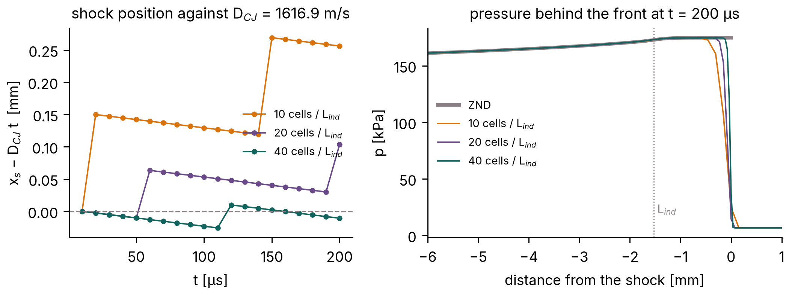{ loading=lazy width=2101 height=783 }
<figcaption>Left: front speed between outputs 10 µs apart. Right: pressure behind the front at 200 µs against the ZND profile; the dotted line is the ZND induction length.</figcaption>
</figure>

| Cells per induction length | Front speed | vs DCJ | Induction length | vs ZND | Peak pressure |
|---:|---:|---:|---:|---:|---:|
| 10 (152.5 µm) | 1618.8 m/s | +0.11% | 1.456 mm | −4.5% | 174.8 kPa |
| 20 (76.3 µm) | 1617.0 m/s | +0.01% | 1.497 mm | −1.8% | 175.2 kPa |
| 40 (38.1 µm) | 1617.0 m/s | 0.00% | 1.567 mm | +2.7% | 174.7 kPa |
| ZND | 1616.9 m/s | | 1.525 mm | | 174.7 kPa (von Neumann) |

The front keeps the CJ speed to 0.01% from 20 cells per induction length: the shock stays within two cells of the position of a wave moving at DCJ (left of the figure; the shock position moves in whole cells). The induction length is within 5% of the ZND value at all three resolutions, a difference of at most one cell at 40 (2.5%), and the peak pressure, the largest over the second half of the run, matches the von Neumann pressure, the pressure right behind a non-reacting shock at DCJ.

### Laminar flame speed {#flame-speed}

Mallard 0.4.0
{ .mallard-provenance }

Freely propagating premixed H2/air flames at 300 K and 1 atm, φ = 0.6 to 1.4, with mixture-averaged and unity-Lewis-number transport, against Cantera's `FreeFlame` with the same mechanism and transport model (the [`premixed_flame`](docs/examples.md#premixed-flame) example). Each run is a strip in the flame's frame, started from Cantera's flame, from 6 thermal thicknesses δT upstream of the flame to 9 downstream, with 20 cells per δT; the fresh mixture enters at Cantera's flame speed, and the flame speed is the consumption speed of the deficient reactant, averaged over the last third of two flame times δT/SL. Navier–Stokes, MUSCL, HLLC, SSPRK3 at CFL 0.4.

<figure class="mallard-figure" markdown>
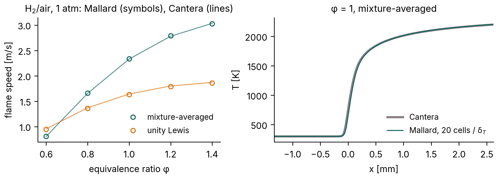{ loading=lazy width=2100 height=753 }
<figcaption>Left: flame speeds with both transport models. Right: temperature through the stoichiometric flame with mixture-averaged transport.</figcaption>
</figure>

| φ | 0.6 | 0.8 | 1.0 | 1.2 | 1.4 |
|---|---:|---:|---:|---:|---:|
| Cantera, mixture-averaged [m/s] | 0.8075 | 1.6567 | 2.3317 | 2.7806 | 3.0341 |
| Mallard | +0.38% | +0.31% | +0.24% | +0.32% | −0.20% |
| Cantera, unity Lewis [m/s] | 0.9575 | 1.3716 | 1.6431 | 1.8013 | 1.8713 |
| Mallard | −0.81% | −0.72% | −0.68% | −0.65% | −0.56% |

All ten flame speeds are within 0.81% of Cantera's (the lean mixture-averaged run stopped after 1.35 of its two flame times). For CH4/air at φ = 1 with GRI-Mech 3.0, the design note reports −0.93% (mixture-averaged) and −0.04% (unity Lewis).

### Laminar flame speed, CH4/air {#flame-speed-ch4}

[`040fb35`](https://github.com/MatthewBonanni/mallard/commit/040fb35) (0.6.0 + 114 commits), merged in [#241](https://github.com/MatthewBonanni/mallard/pull/241) after Mallard 0.7.0
{ .mallard-provenance }

Freely propagating CH4/air flames at 300 K and 1 atm with GRI-Mech 3.0 (53 species, 325 reactions), φ = 0.6 to 1.4, with mixture-averaged and unity-Lewis-number transport, against Cantera's `FreeFlame` with the same mechanism and transport ([#241](https://github.com/MatthewBonanni/mallard/pull/241)). Each flame starts from Cantera's and runs five flame times at CFL 1, at 10, 20 and 40 cells per thermal thickness, on A100 GPUs; the consumption speed is taken over the last flame time.

<figure class="mallard-figure" markdown>
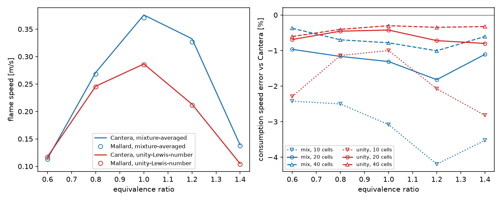{ loading=lazy width=1500 height=600 }
<figcaption>Left: flame speeds at 20 cells per thermal thickness against Cantera. Right: consumption-speed error at 10, 20 and 40 cells.</figcaption>
</figure>

| φ | 0.6 | 0.8 | 1.0 | 1.2 | 1.4 |
|---|---:|---:|---:|---:|---:|
| Cantera, mixture-averaged [m/s] | 0.1144 | 0.2711 | 0.3758 | 0.3325 | 0.1388 |
| Mallard, 10 / 20 / 40 cells | −2.42 / −0.97 / −0.37% | −2.50 / −1.17 / −0.70% | −3.08 / −1.31 / −0.78% | −4.19 / −1.82 / −1.01% | −3.53 / −1.11 / −0.60% |
| Cantera, unity Lewis [m/s] | 0.1177 | 0.2460 | 0.2865 | 0.2132 | 0.1048 |
| Mallard, 10 / 20 / 40 cells | −2.29 / −0.69 / −0.61% | −1.14 / −0.45 / −0.40% | −1.00 / −0.42 / −0.30% | −2.07 / −0.72 / −0.35% | −2.82 / −0.80 / −0.32% |

At 20 cells per thermal thickness every flame speed is within 2% of Cantera's: mixture-averaged 1.0–1.8% slow, unity Lewis 0.4–0.8% slow. At 40 cells the mixture-averaged errors roughly halve. Some 40-cell runs ran 2.2–4.1 rather than five flame times and are still settling slowly downward. Halving the CFL number changes the flame speeds by at most 0.05%.

### Thermal diffusion (Soret effect) {#soret}

[`caa9b4a`](https://github.com/MatthewBonanni/mallard/commit/caa9b4a) with local changes (0.6.0 + 125 commits), merged in [#243](https://github.com/MatthewBonanni/mallard/pull/243) after Mallard 0.7.0
{ .mallard-provenance }

`physics.soret = true` adds thermal diffusion to the species fluxes with mixture-averaged transport, using Cantera's mixture-averaged thermal-diffusion coefficients ([#243](https://github.com/MatthewBonanni/mallard/pull/243)). The test case is freely propagating H2/air flames at 300 K and 1 atm against Cantera's `FreeFlame` with and without thermal diffusion: the setup of the [H2 flame speeds](#flame-speed), with 20 cells per thermal thickness, CFL 0.2 and two flame times.

| φ | 0.4 | 0.5 | 0.6 | 1.0 |
|---|---:|---:|---:|---:|
| consumption speed vs Cantera, without Soret | +0.40% | +0.19% | +0.28% | +0.21% |
| consumption speed vs Cantera, with Soret | −0.58% | −0.07% | +0.34% | +0.41% |
| change from thermal diffusion, Cantera / Mallard | −3.10 / −4.05% | −6.98 / −7.23% | −9.04 / −8.98% | −8.44 / −8.26% |

Mallard reproduces Cantera's reduction of the flame speed by thermal diffusion to within 0.3 percentage points from φ = 0.5 to 1.0, and to 1 point at φ = 0.4. The coefficients themselves match Cantera's to 6 × 10−13 of the largest. Runs without the option are byte-identical to those before the change.

### SIMPLER splitting {#simpler}

[`beb3c3f`](https://github.com/MatthewBonanni/mallard/commit/beb3c3f) with local changes, and [`3500760`](https://github.com/MatthewBonanni/mallard/commit/3500760) (0.6.0 + 85 and 87 commits), merged in [#235](https://github.com/MatthewBonanni/mallard/pull/235) after Mallard 0.7.0
{ .mallard-provenance }

`[chemistry] coupling = "simpler"` balances the chemistry and the flow with the SIMPLER splitting of Wu, Ma & Ihme (2019) instead of Strang's ([#235](https://github.com/MatthewBonanni/mallard/pull/235)). The reaction substep sees the transport rate at the start of the step as a constant forcing, so a steady state of the coupled equations is a steady state of the scheme. It stays second order, and Strang remains the default. The checks use H2/O2 chemistry with MUSCL, HLLC and SSPRK3.

| Case | Strang | SIMPLER |
|---|---:|---:|
| [CJ detonation](#detonation), induction length vs ZND, 10 cells per induction length, CFL 0.35 / 0.5 / 0.7 / 1.0 / 1.2 | −4.5 / −5.5 / −8.2 / −25.5 / −36.4% | −7.3 / −7.3 / 0.0 / −0.9 / −5.5% |
| the same, 20 cells per induction length, CFL 0.35 / 0.7 / 1.0 | −1.4 / – / −11.4% | −0.9 / +2.3 / +3.2% |
| detonation speed, D/DCJ − 1 | within 0.16% | within 0.16% |
| detonation cost (8 CPU threads, 3934 cells) | 222 s at CFL 0.35 | 60 s at CFL 1.0 |
| stirred reactor (H2/air from 300 K), extinction residence time at dt = 0.1 / 0.3 / 1 τ (exact 40–50 µs) | 50 µs / 100 µs / > 1 ms | 40–50 µs at every dt |
| stirred reactor, τ = 100 µs, dt = 0.1 τ: temperature | 2695.8 K (+24 K) | 2671.9 K (exact) |
| H2/air flame speeds vs Cantera, φ = 0.6 / 1.0 / 1.4 | +0.60 to −0.21% | +0.53 to −0.20% |

Detonations can therefore run at CFL 1.0 instead of 0.35, 3.7 times cheaper, with the mean induction length within 5% and the detonation speed unchanged. The price is a front position that oscillates more from output to output (5.5% against 0.6% RMS at CFL 1.0 and 10 cells). For steady premixed flames, where Strang's splitting error is already below 0.1%, SIMPLER is only 9–15% cheaper.

### Cellular detonation {#cellular-detonation}

Development code just before the 0.4.0 release (version string 0.3.0, run 3 October 2026, the branch of [#130](https://github.com/MatthewBonanni/mallard/pull/130); commit not recorded), released in 0.5.0
{ .mallard-provenance }

The detonation of the [CJ detonation section](#detonation) in two dimensions, the [`detonation_2d`](docs/examples.md#detonation-2d) example: a 6 cm wide channel with slip walls, 0.15 mm cells (10 per induction length, as in Oran et al. 1998), 1.2 million cells, 18,900 time steps in 39 minutes on two A100 GPUs, 71% of it in the chemistry. The run starts from the ZND solution with six seeded pockets of fresh gas behind the front: a planar ZND front, with or without one such pocket, stays planar at 5 to 20 cells per induction length, so the cells here grow from the seeds and not from the front's own instability. The [`[[write_data]]`](docs/input.md#write_data) variable `P_MAX`, the largest pressure each cell has seen, gives the numerical soot foil.

<figure class="mallard-figure" markdown>
<video data-autoplay controls loop muted playsinline preload="none" width="1920" height="1080" poster="../media/detonation_2d_poster.jpg" aria-label="Pressure and numerical soot foil of the cellular detonation"><source src="../media/detonation_2d.mp4" type="video/mp4"></video>
<figcaption>Pressure and the numerical soot foil near the front, and the whole foil below.</figcaption>
</figure>

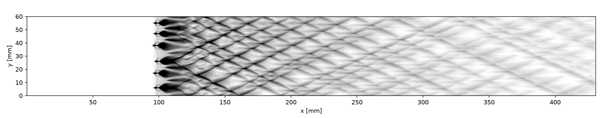{ loading=lazy width=2100 height=412 }

The front runs at 1617.0 m/s, the CJ speed to 0.01%. The seeds give eight strong triple points at x = 140 to 180 mm, cells about 15 mm wide, which coarsen to three or four (30 to 40 mm) by x ≈ 260 mm; after 33 cm of travel the cells are not yet regular. Published numerical cell widths for this mixture are about 3 cm (Oran et al. 1998; Deiterding 2011).

### Cellular detonation in 3D {#cellular-detonation-3d}

Development code between 0.5.0 and 0.6.0: [`3bec90f`](https://github.com/MatthewBonanni/mallard/commit/3bec90f) with the tools of [#183](https://github.com/MatthewBonanni/mallard/pull/183)
{ .mallard-provenance }

The detonation of the [previous section](#cellular-detonation) in a 3 cm square duct, the configuration of Deiterding's (2011) and Tsuboi et al.'s (2002) 3D runs, in the [`detonation_3d`](docs/examples.md#detonation-3d) example. The resolution is that of the 2D case, 0.15 mm hexahedra (10 per induction length), 200 × 200 across the duct. A 7.2 cm window follows the front: 480 × 200 × 200 = 19.2 million cells. Every 6 µs the run drops the burnt gas more than 5 cm behind the front, appends fresh gas ahead, and keeps the peak pressure of the dropped wall cells for the soot foils. The run starts from a 2D cellular detonation turned into in-phase transverse waves in y and z. MUSCL with HLL: HLLC grows grid-scale odd–even noise on the planar 3D front within 15 µs. The run took 12,180 steps, 4.6 hours on four A100 GPUs.

<figure class="mallard-figure" markdown>
<video data-autoplay controls loop muted playsinline preload="none" width="1920" height="1080" poster="../media/detonation_3d_poster.jpg" aria-label="Leading shock of a cellular detonation in a square duct colored by the pressure behind it, and the numerical soot foils of the four walls"><source src="../media/detonation_3d.mp4" type="video/mp4"></video>
<figcaption>The leading shock colored by the pressure behind it, the soot foils on the two far walls, and the foils of all four walls over 17 cm of travel.</figcaption>
</figure>

Over t = 96–204 µs (17 cm of travel), the front runs at 1620.6 m/s over the second half, DCJ to 0.2%. Its transverse waves stay as two orthogonal families of lines parallel to the walls, crossing in phase. This is the rectangular mode of Deiterding's and Tsuboi et al.'s runs. The peak pressure behind the shock stays at 200–215 kPa (von Neumann: 175 kPa) to the end, while in the 2D precursor it decays. On every wall the foil shows diagonal triple-point tracks crossing every 6.4 cm of travel (6.5 cm in the 2D precursor). It also shows dark bands across the whole wall, every 4–8.6 cm and alternating between opposite walls, where a wave family hits the wall face-on (the slapping waves of Williams, Bauwens & Oran 1996). The start is symmetric under exchanging y and z, and so is the solution: the foils of opposite wall pairs are identical.

### Lean hydrogen flame {#lean-flame}

Development code just before the 0.4.0 release (version string 0.3.0, run 3 October 2026, the branch of [#131](https://github.com/MatthewBonanni/mallard/pull/131); commit not recorded), released in 0.5.0
{ .mallard-provenance }

A lean H2/air flame, φ = 0.4, 700 K, 1 atm, in a periodic channel 7.8 mm wide and 12.2 mm long on 36 µm cells (72,576), started from the same wrinkled planar flame with mixture-averaged transport and with unity Lewis numbers (the [`flame_2d`](docs/examples.md#flame-2d) example; 82 and 67 minutes on one A100). On the same mesh, the planar flame runs at 3.3446 m/s (mixture-averaged) and 3.1093 m/s (unity Lewis), against Cantera's 3.346 and 3.129 m/s (−0.04% and −0.6%).

<figure class="mallard-figure" markdown>
<video data-autoplay controls loop muted playsinline preload="none" width="1920" height="1080" poster="../media/flame_2d_poster.jpg" aria-label="Temperature over the adiabatic flame temperature of the lean hydrogen flame with both transport models, and their consumption speeds"><source src="../media/flame_2d.mp4" type="video/mp4"></video>
<figcaption>Temperature over the adiabatic flame temperature with mixture-averaged transport (left) and unity Lewis numbers (right), and the consumption speeds over the planar flame's.</figcaption>
</figure>

With unity Lewis numbers the burnt gas stays within 0.996 to 1.000 of the adiabatic flame temperature Tad, and the wrinkle grows only by the Darrieus–Landau instability: the consumption speed peaks at 1.08 SL at 2.4 ms. With mixture-averaged transport, the differential diffusion of hydrogen makes the burnt gas behind the bulges superadiabatic, from 0.958 to 1.017 Tad, and the consumption speed peaks at 1.14 SL at 1.1 ms.

### Stratified autoignition {#autoignition}

Development code between 0.5.0 and 0.6.0: [`bdca83d`](https://github.com/MatthewBonanni/mallard/commit/bdca83d) with the tools of [#174](https://github.com/MatthewBonanni/mallard/pull/174)
{ .mallard-provenance }

Autoignition of a thermally stratified lean H2/air mixture at constant volume, the configuration of the DNS of Chen et al. (2006), Hawkes et al. (2006) and Sankaran et al. (2005), in the [`autoignition_2d`](docs/examples.md#autoignition-2d) example.

- **Mixture:** φ = 0.1, a mean 1070 K and 41 atm, in a 4.1 mm periodic square.
- **Initial fields:** random temperature fluctuations T′ of 3.75, 7.5, 15 and 30 K, and decaying turbulence (u′ = 0.5 m/s). Both follow Passot–Pouquet spectra with most energetic lengths of 1.25 mm, from one seed.
- **Mesh and models:** 400 × 400 cells of 10.25 µm, 11–15 per deflagration thickness. H2/O2 chemistry and mixture-averaged transport.
- **Reference delay:** τ0 = 3.650 ms, the homogeneous ignition delay, from both Cantera and `MallardReactor`.
- **Cost:** 1.4–2.0 million steps per run, 4.7–5.5 hours on four A100 GPUs.

<figure class="mallard-figure" markdown>
<video data-autoplay controls loop muted playsinline preload="none" width="1920" height="1080" poster="../media/autoignition_2d_poster.jpg" aria-label="Temperature and heat release rate of four autoignition runs with temperature fluctuations of 3.75 to 30 K, and their mean heat release rate"><source src="../media/autoignition_2d.mp4" type="video/mp4"></video>
<figcaption>Temperature (top) and heat release rate (bottom) of the four runs, and their mean heat release rate against the multizone model and the homogeneous reactor.</figcaption>
</figure>

<figure class="mallard-figure" markdown>
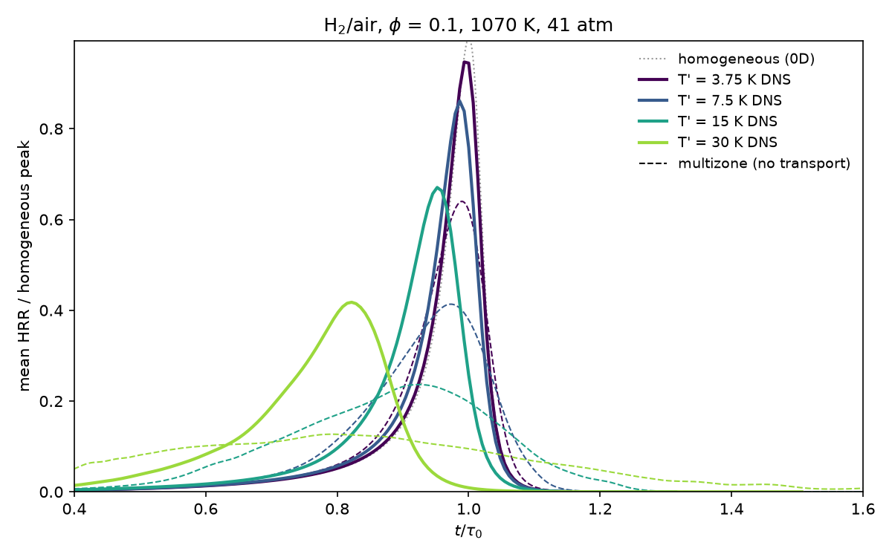{ loading=lazy width=1200 height=750 }
<figcaption>Mean heat release rate over the homogeneous reactor's peak: DNS (solid), multizone model of each initial field without transport (dashed), homogeneous reactor (dotted).</figcaption>
</figure>

| T′ [K] | peak time / τ0 | FWHM / τ0 | peak / homogeneous | deflagrative share | median front speed |
|---|---:|---:|---:|---:|---:|
| 3.75 | 0.993 (0.990) | 0.062 (0.110) | 0.95 (0.64) | 0.0% | 16.7 SL |
| 7.5 | 0.986 (0.973) | 0.069 (0.187) | 0.86 (0.41) | 0.2% | 9.1 SL |
| 15 | 0.952 (0.924) | 0.089 (0.354) | 0.67 (0.24) | 2.9% | 5.1 SL |
| 30 | 0.822 (0.791) | 0.164 (0.697) | 0.42 (0.13) | 25% | 2.4 SL |

Columns 2–4 describe the mean heat release rate; the multizone model is in brackets. The deflagrative share is the heat released where the H2O isolines move slower than 1.5 SL. The median front speed is the heat-release-weighted median of the displacement speed |Sd*| over the deflagration speed SL(Tu, p) of the local fresh gas.

<figure class="mallard-figure" markdown>
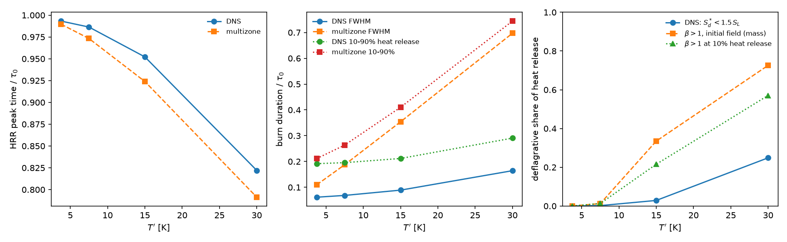{ loading=lazy width=1950 height=600 }
<figcaption>Peak time, burn duration and deflagrative share against T′: DNS, multizone model, and Sankaran et al.'s β criterion applied to the initial field and at 10% heat release.</figcaption>
</figure>

<figure class="mallard-figure" markdown>
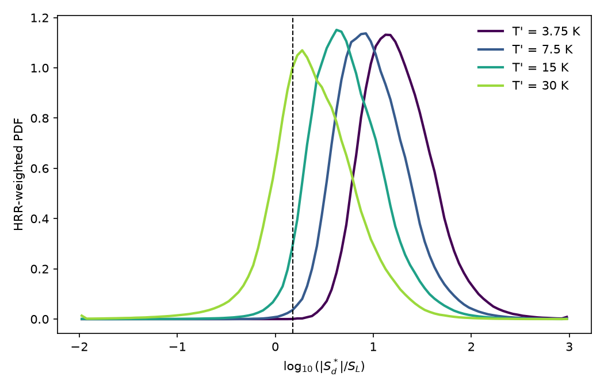{ loading=lazy width=1050 height=675 }
<figcaption>Heat-release-weighted distribution of the front speed |Sd*| / SL; the dashed line is 1.5 SL.</figcaption>
</figure>

As the papers describe, larger fluctuations ignite earlier and burn longer, and the fronts slow from spontaneous ignition towards deflagration. The comparison is qualitative: the papers' figures were not available for a quantitative one, and they used another H2 mechanism.

- **Multizone model:** without transport, it predicts bursts 2–4 times wider than the DNS. Turbulent mixing halves T′ before ignition (at T′ = 15 K, to 8.5 K by 0.45 τ0), and deflagrations consume the coldest gas.
- **β criterion:** Sankaran et al.'s criterion marks a larger part of the mixture as deflagrative than the DNS front speeds show (figure above).
- **Threshold:** the deflagrative share depends on the threshold. At T′ = 30 K it is 15%, 25% and 51% at 1.1, 1.5 and 3 SL, but the shift of the front-speed distribution with T′ does not depend on it.

## Large-eddy simulation {#les}

Mallard's large-eddy simulation ([#203](https://github.com/MatthewBonanni/mallard/pull/203), [#205](https://github.com/MatthewBonanni/mallard/pull/205), [#213](https://github.com/MatthewBonanni/mallard/pull/213), [#214](https://github.com/MatthewBonanni/mallard/pull/214), [#215](https://github.com/MatthewBonanni/mallard/pull/215), [#222](https://github.com/MatthewBonanni/mallard/pull/222), [#223](https://github.com/MatthewBonanni/mallard/pull/223), [#230](https://github.com/MatthewBonanni/mallard/pull/230), [#224](https://github.com/MatthewBonanni/mallard/pull/224); [design](docs/design/les.md)). The LES uses:

- an explicit eddy-viscosity model, Sigma (Nicoud et al. 2011) by default. In 3D, its filter width is the cell-volume width with the anisotropy correction of Scotti, Meneveau & Lilly (1993), the default since [#223](https://github.com/MatthewBonanni/mallard/pull/223);
- the hybrid convective flux: kinetic-energy-preserving and central, with the Riemann solver only where a compression sensor fires;
- MUSCL without a limiter.

The kinetic-energy budget of `[integrals]` measures how much of the dissipation comes from the model, the scheme and molecular viscosity. That tells explicit LES, where the model does the work, from implicit LES, where the scheme does. Each case also runs without the model and with HLLC at every face.

### Decaying isotropic turbulence {#les-cbc}

[`d8060fd`](https://github.com/MatthewBonanni/mallard/commit/d8060fd) with the uncommitted files of [#213](https://github.com/MatthewBonanni/mallard/pull/213) (0.5.0 + 83 commits on the LES branch). The dynamic constant: development code between 0.6.0 and 0.7.0 ([#223](https://github.com/MatthewBonanni/mallard/pull/223))
{ .mallard-provenance }

The grid turbulence of Comte-Bellot & Corrsin (1971), in the [`cbc_les`](docs/examples.md#cbc-les) example. A periodic box of eleven mesh lengths starts from the measured spectrum at the first station (t U0/M = 42). The spectra are compared at the next two stations, 98 and 171, with a fictitious sound speed for a turbulent Mach number of 0.1. Spectral error is the log10 RMS of ELES/ECBC up to 2/3 of the grid cutoff wavenumber, at stations 2 / 3. The dissipation shares are averaged over the run.

<figure class="mallard-figure" markdown>
{ loading=lazy width=1500 height=630 }
<figcaption>Energy spectra at t U0/M = 98 and 171 against Comte-Bellot & Corrsin: Sigma with the hybrid flux, without a model, and with HLLC.</figcaption>
</figure>

| Mesh | Flux | Model | Spectral error | Numerical / SGS share of dissipation |
|---|---|---|---:|---:|
| 64³ | hybrid | Sigma | 0.107 / 0.104 | 1.3 / 69.1% |
| 64³ | hybrid | Sigma, C = 1.8 | 0.058 / 0.063 | 1.3 / 79.6% |
| 64³ | hybrid | none | 0.226 / 0.375 | −7.7 / 0% |
| 64³ | HLLC | Sigma, C = 1.8 | 0.154 / 0.217 | 46.3 / 43.5% |
| 64³ | HLLC | none (implicit LES) | 0.135 / 0.114 | 83.8 / 0% |
| 128³ | hybrid | Sigma | 0.063 / 0.085 | 2.0 / 52.2% |
| 128³ | hybrid | none | 0.182 / 0.249 | 1.8 / 0% |

- **Hybrid flux:** the model does the work, and the scheme's share is 1–2% at every resolution. Without the model, energy piles up at the grid cutoff, and the spectral error is 2–4 times larger.
- **HLLC at every face:** the scheme does 84% of the dissipation without a model, and still 46% with one. Such runs are implicit LES whatever the model.
- **Model constant:** the best Sigma constant depends on the resolution, 1.8 at 64³ and the literature's 1.35 (the default) at 128³. The opt-in dynamic procedure sets C to 1.6, 1.4 and 1.15 at 32³, 64³ and 128³. It gives the best spectra of any run at 128³ (0.060 / 0.054), but not the 1.8 that fits 64³.
- **Budget:** these shares were measured before [#222](https://github.com/MatthewBonanni/mallard/pull/222) redefined the numerical dissipation from the scheme's own discrete pressure work. For non-reacting flows the change is small: at 64³ with C = 1.8 the numerical share goes from 0.7% to −0.9%.

### Turbulent channel flow, Reτ = 395 and 590 {#les-channel}

Cell-volume width at Reτ = 395: the [#214](https://github.com/MatthewBonanni/mallard/pull/214) branch around the 0.6.0 release (commit not recorded). Scotti's width, the dynamic constant and Reτ = 590: development code between 0.6.0 and 0.7.0 ([#223](https://github.com/MatthewBonanni/mallard/pull/223), [#230](https://github.com/MatthewBonanni/mallard/pull/230))
{ .mallard-provenance }

Wall-resolved LES of the channel at Reτ = 395 against Moser, Kim & Mansour (1999), in the [`channel_les`](docs/examples.md#channel-les) example. The box is 2πh × 2h × πh with 64³ hexahedra: Δx+ 39, Δz+ 19, Δy+ 0.9 at the wall. The mass flow is held at the DNS's bulk Reynolds number, with resolved fluctuations averaged over t = 100–300 h/Ub. MKM's Reτ at this bulk Reynolds number is 392.2.

<figure class="mallard-figure" markdown>
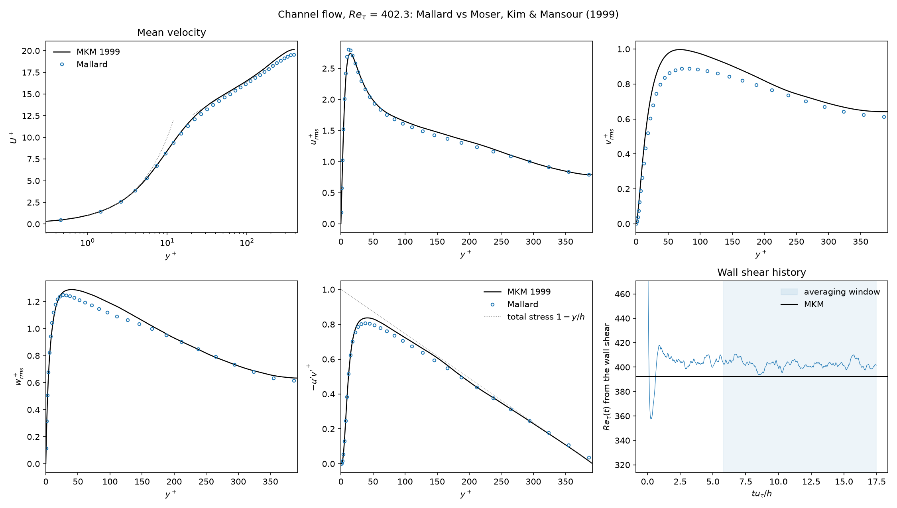{ loading=lazy width=2250 height=1275 }
<figcaption>Reτ = 395: mean velocity, resolved RMS velocities and Reynolds shear stress against MKM (Sigma with the cell-volume width, 64³), and Reτ(t) from the wall shear.</figcaption>
</figure>

| Mesh | Flux | Model | Reτ | Cf | numerical / SGS / molecular dissipation |
|---|---|---|---:|---:|---:|
| 64³ | hybrid | Sigma, Scotti width (default) | +0.7% | +0.9% | not reported |
| 64³ | hybrid | Sigma, cell-volume width | 402.3 (+2.6%) | +4.8% | 3.5 / 12.6 / 83.9% |
| 64³ | hybrid | Sigma, C = 1.8 | 389.4 (−0.7%) | −1.9% | 2.8 / 16.6 / 80.6% |
| 64³ | hybrid | none | 420.1 (+7.1%) | +14.2% | 5.0 / 0 / 95.0% |
| 64³ | HLLC | Sigma, C = 1.8 | 317.6 (−19%) | −35% | 13.5 / 5.4 / 81.1% |
| 48³ | hybrid | Sigma, C = 1.8 | 381.3 (−2.8%) | −5.9% | 3.2 / 17.9 / 78.9% |

- **Model on, 64³:** Reτ is within 3% at both Sigma constants and with either filter width, and the mean velocity is within 3% across y+ = 30–300. Scotti's width brings Reτ from +2.6% to +0.7%. The opt-in dynamic constant (C = 1.09) gives +4.0%, worse than the static one.
- **Model off:** Reτ is 7% high, more than twice the error with the model.
- **Resolved stresses:** the resolved urms, wrms and −u′v′ are within 10%. The resolved vrms peak is 11–15% low (see 590 below).
- **HLLC instead of the hybrid flux:** the scheme removes 2.5 times as much energy as the model. Reτ is then 19% low.
- **Refinement:** the error with the model decreases from 48³ to 64³.

At Reτ = 590 (`input_590.toml`, MKM's Reτ 587.2), the numerics of the 395 case run on 96³ hexahedra: Δx+ 38, Δz+ 19, Δy+ 0.87. Statistics are averaged over t = 60–200 h/Ub.

<figure class="mallard-figure" markdown>
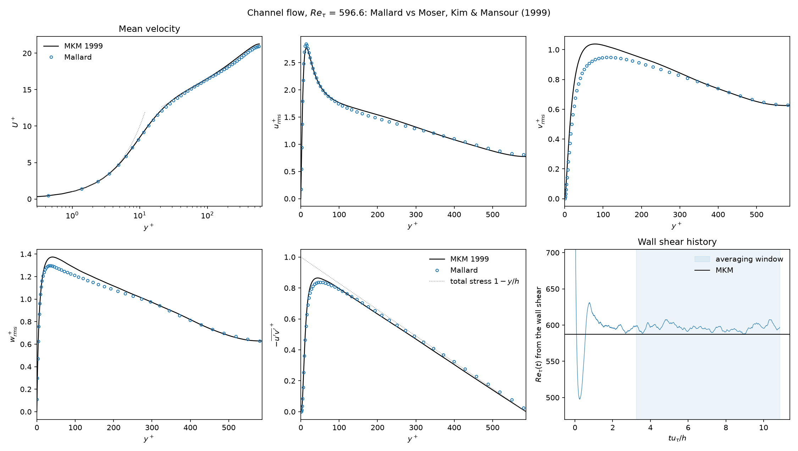{ loading=lazy width=2250 height=1275 }
<figcaption>Reτ = 590: profiles against MKM (Sigma with Scotti's width, the default), and Reτ(t).</figcaption>
</figure>

| Model | Reτ | Cf | peak vrms+ (MKM 1.04) | numerical / SGS / molecular dissipation |
|---|---:|---:|---:|---:|
| Sigma, Scotti width (default) | 596.6 (+1.6%) | +2.9% | 0.95 | 3.3 / 16.2 / 80.6% |
| Sigma, cell-volume width | 611.0 (+4.1%) | +7.9% | 0.96 | 2.3 / 13.5 / 84.2% |
| none | 632.7 (+7.8%) | +15.7% | 1.02 | 3.3 / 0 / 96.7% |

- **Scotti's width:** the targets hold at 590. Reτ is within 3%, the mean profile within 2% for y+ = 30–100, and urms, wrms and −u′v′ within 10%.
- **Cell-volume width:** the model halves the model-off error but misses the Reτ target.
- **vrms:** the resolved peak is 8–9% low at 590, and 8% low at 395 on a mesh with Δx+ 26 and Δz+ 13. It barely depends on the model, so it is the streamwise and spanwise resolution of the near-wall cycle.

### Thickened flame {#les-tfles}

[`5741305`](https://github.com/MatthewBonanni/mallard/commit/5741305) with the uncommitted files of [#215](https://github.com/MatthewBonanni/mallard/pull/215) (0.6.0 + 6 commits)
{ .mallard-provenance }

The dynamically thickened flame model (TFLES; Colin et al. 2000), with Charlette et al.'s (2002) efficiency function, on a one-dimensional stoichiometric H2/air flame. Cantera gives sL = 2.3324 m/s and δL = 0.330 mm; MUSCL with HLLC.

| Mesh | Thickening F | Consumption speed | Displacement speed | Thermal thickness |
|---|---:|---:|---:|---:|
| 2 cells per δL | 7.91 | 2.327 m/s (−0.2%) | 2.291 m/s (−1.8%) | 2.615 mm (F δL = 2.610 mm) |
| 0.5 cells per δL | 31.6 | 2.328 m/s (−0.2%) | 2.251 m/s (−3.5%) | |
| 0.5 cells per δL, no model | 1 | 2.273 m/s (−2.5%) | 2.240 m/s (−4.0%) | one cell |

The thickened flame keeps the laminar flame speed with the thickness F δL it is designed to have. Without the model, the flame's structure is one cell wide, set by the scheme.

### Premixed flame in decaying turbulence {#les-flame}

Development code between 0.6.0 and 0.7.0, the branch of [#222](https://github.com/MatthewBonanni/mallard/pull/222) (from [`a172f6f`](https://github.com/MatthewBonanni/mallard/commit/a172f6f))
{ .mallard-provenance }

A stoichiometric H2/air flame in decaying turbulence, in the [`flame_turbulence`](docs/examples.md#flame-turbulence) example.

- **DNS reference:** 224 × 128 × 128 cells of δL/10, u′ = 2.1 SL, Karlovitz number 2, numerical dissipation 0.4%.
- **LES:** TFLES with the Sigma model, on the same initial field box-filtered to Δ = 0.4, 0.8 and 1.6 δL (thickening F = 2, 4, 8).
- **Measured:** the turbulent flame speed ST, from the rate at which the fresh gas is consumed, over 0.2–0.4 ms. The DNS gives ST/SL = 1.132.

<figure class="mallard-figure" markdown>
<video data-autoplay controls loop muted playsinline preload="none" width="1600" height="880" poster="../media/flame_turbulence_poster.jpg" aria-label="Flame surface colored by heat release rate and vortex isosurfaces of the DNS of a premixed hydrogen-air flame in decaying turbulence"><source src="../media/flame_turbulence.mp4" type="video/mp4"></video>
<figcaption>The DNS: the flame surface colored by heat release rate, and the turbulent eddies ahead of it in the fresh gas.</figcaption>
</figure>

<figure class="mallard-figure" markdown>
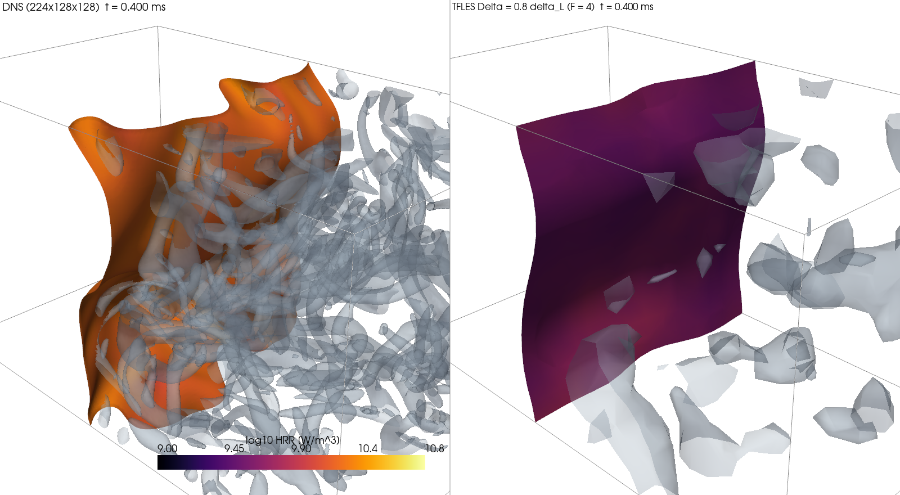{ loading=lazy width=1600 height=880 }
<figcaption>The DNS (left) and TFLES at Δ = 0.8 δL (right) at t = 0.4 ms.</figcaption>
</figure>

| Δ / δL | TFLES, Colin efficiency (default) | TFLES, `eddy_viscosity` subgrid velocity | TFLES, E = 1 | quasi-laminar |
|---|---:|---:|---:|---:|
| 0.4 | 1.056 (−6.7%) | 1.065 (−5.9%) | 1.050 (−7.2%) | 1.088 (−3.9%) |
| 0.8 | 1.053 (−6.9%) | 1.034 (−8.6%) | 0.985 (−13%) | 1.166 (+3.0%) |
| 1.6 | 2.240 (+98%) | 1.008 (−11%) | 0.947 (−16%) | 1.051 (−7.1%) |

<figure class="mallard-figure" markdown>
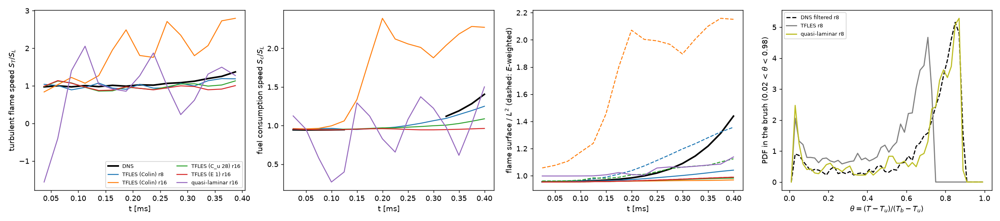{ loading=lazy width=2470 height=546 }
<figcaption>Turbulent flame speed, fuel consumption speed and flame surface over time, and temperature distributions in the flame brush: DNS and LES variants.</figcaption>
</figure>

- **TFLES with the default efficiency** is within 10% of the DNS for Δ ≤ 0.8 δL. It is smooth in time, and the scheme's dissipation is at most 20% of the model's.
- **Δ = 1.6 δL:** Colin's subgrid-velocity operator overshoots and doubles the flame speed. On the filtered DNS its subgrid velocity is 5–8 times the DNS's.
- **Second turbulent field:** an independent case, not used for any calibration, shows the same doubling.
- **The opt-in `eddy_viscosity` subgrid velocity** removes the overshoot. Its constant is calibrated on this case and is not independently validated.
- **Quasi-laminar runs, without a flame model,** get a close mean speed on coarse meshes. They are erratic in time (33–36% rms) and up to 15% numerically dissipated.

### Non-premixed flame in turbulence: PaSR (experimental) {#les-pasr}

Development code between 0.6.0 and 0.7.0, the branches of [#222](https://github.com/MatthewBonanni/mallard/pull/222) and [#224](https://github.com/MatthewBonanni/mallard/pull/224)
{ .mallard-provenance }

!!! warning "Experimental"
    The partially stirred reactor closure (`[les.combustion] model = "pasr"`, [#224](https://github.com/MatthewBonanni/mallard/pull/224)) is an opt-in, not a default. It helps at moderate filter widths and overcorrects on coarse meshes.

PaSR scales the chemical rates of each cell by κ = τc / (τc + τmix). The chemical time comes from the heat release, and the mixing time from the filter width and the molecular plus eddy viscosity.

- **DNS reference:** an H2/N2 (25% H2) against air diffusion flame, started from a counterflow profile (strain 160 1/s), in the box and decaying turbulence of the [premixed case](#les-flame), to 0.4 ms. The DNS temperature at the stoichiometric surface is 1262 K.
- **LES:** Sigma model at Δ = 0.27 and 0.53 mm (8 and 16 DNS cells), with PaSR and with quasi-laminar chemistry, i.e. the filtered state's rates without a combustion model.
- **Measured:** the heat release over 0.2–0.4 ms, against the DNS.

| Δ | PaSR | quasi-laminar |
|---|---:|---:|
| 0.27 mm | −10.7% (κ 0.62 at the stoichiometric surface) | +16.6% |
| 0.53 mm | −50% (Tst 892 K, near extinction; κ 0.26) | +41% |

- **Finer width:** PaSR moves the heat release the right way.
- **Coarser width:** it overcorrects. The mixing time τmix = Δ²/(ν + νt), with the constant Cmix = 1, is overestimated, and the flame comes spuriously close to extinction.
- **Budget:** |εnum/εSGS| ≤ 0.10 with PaSR, 0.23 quasi-laminar.

## References

The sources of the reference data and test cases on this page. The sources of the numerical methods themselves, with where Mallard uses each, are on the [References](docs/references.md) page.

- F. S. Billig, Shock-wave shapes around spherical- and cylindrical-nosed bodies, *J. Spacecraft Rockets* 4, 822–823 (1967). [doi:10.2514/3.28969](https://doi.org/10.2514/3.28969)
- M. E. Brachet, D. I. Meiron, S. A. Orszag, B. G. Nickel, R. H. Morf and U. Frisch, Small-scale structure of the Taylor–Green vortex, *J. Fluid Mech.* 130, 411–452 (1983).
- F. Charlette, C. Meneveau and D. Veynante, A power-law flame wrinkling model for LES of premixed turbulent combustion. Part I: non-dynamic formulation and initial tests, *Combust. Flame* 131, 159–180 (2002). [doi:10.1016/S0010-2180(02)00400-5](https://doi.org/10.1016/S0010-2180%2802%2900400-5)
- J. H. Chen, E. R. Hawkes, R. Sankaran, S. D. Mason and H. G. Im, Direct numerical simulation of ignition front propagation in a constant volume with temperature inhomogeneities: I. Fundamental analysis and diagnostics, *Combust. Flame* 145, 128–144 (2006). [doi:10.1016/j.combustflame.2005.09.017](https://doi.org/10.1016/j.combustflame.2005.09.017)
- O. Colin, F. Ducros, D. Veynante and T. Poinsot, A thickened flame model for large eddy simulations of turbulent premixed combustion, *Phys. Fluids* 12, 1843–1863 (2000). [doi:10.1063/1.870436](https://doi.org/10.1063/1.870436)
- G. Comte-Bellot and S. Corrsin, Simple Eulerian time correlation of full- and narrow-band velocity signals in grid-generated, 'isotropic' turbulence, *J. Fluid Mech.* 48, 273–337 (1971). [doi:10.1017/S0022112071001599](https://doi.org/10.1017/S0022112071001599)
- G. S. Constantinescu and K. D. Squires, LES and DES investigations of turbulent flow over a sphere at Re = 10,000, *Flow Turbul. Combust.* 70, 267–298 (2003). [doi:10.1023/B:APPL.0000004937.34078.71](https://doi.org/10.1023/B:APPL.0000004937.34078.71)
- V. Daru and C. Tenaud, Numerical simulation of the viscous shock tube problem by using a high resolution monotonicity-preserving scheme, *Computers & Fluids* 38, 664–676 (2009).
- R. Deiterding, High-resolution numerical simulation and analysis of Mach reflection structures in detonation waves in low-pressure H2–O2–Ar mixtures: a summary of results obtained with the adaptive mesh refinement framework AMROC, *J. Combust.* 2011, 738969 (2011). [doi:10.1155/2011/738969](https://doi.org/10.1155/2011/738969)
- R. P. Fedkiw, B. Merriman and S. Osher, High accuracy numerical methods for thermally perfect gas flows with chemistry, *J. Comput. Phys.* 132, 175–190 (1997). [doi:10.1006/jcph.1996.5622](https://doi.org/10.1006/jcph.1996.5622)
- D. G. Goodwin, R. L. Speth, H. K. Moffat and B. W. Weber, Cantera: an object-oriented software toolkit for chemical kinetics, thermodynamics, and transport processes, version 3.2.0, [cantera.org](https://www.cantera.org).
- J.-F. Haas and B. Sturtevant, Interaction of weak shock waves with cylindrical and spherical gas inhomogeneities, *J. Fluid Mech.* 181, 41–76 (1987). [doi:10.1017/S0022112087002003](https://doi.org/10.1017/S0022112087002003)
- E. R. Hawkes, R. Sankaran, P. P. Pébay and J. H. Chen, Direct numerical simulation of ignition front propagation in a constant volume with temperature inhomogeneities: II. Parametric study, *Combust. Flame* 145, 145–159 (2006). [doi:10.1016/j.combustflame.2005.09.018](https://doi.org/10.1016/j.combustflame.2005.09.018)
- T. A. Johnson and V. C. Patel, Flow past a sphere up to a Reynolds number of 300, *J. Fluid Mech.* 378, 19–70 (1999). [doi:10.1017/S0022112098003206](https://doi.org/10.1017/S0022112098003206)
- A. Keating, U. Piomelli, E. Balaras and H.-J. Kaltenbach, A priori and a posteriori tests of inflow conditions for large-eddy simulation, *Phys. Fluids* 16, 4696–4712 (2004). [doi:10.1063/1.1811672](https://doi.org/10.1063/1.1811672)
- J. Kim, D. Kim and H. Choi, An immersed-boundary finite-volume method for simulations of flow in complex geometries, *J. Comput. Phys.* 171, 132–150 (2001). [doi:10.1006/jcph.2001.6778](https://doi.org/10.1006/jcph.2001.6778)
- M. Klein, A. Sadiki and J. Janicka, A digital filter based generation of inflow data for spatially developing direct numerical or large eddy simulations, *J. Comput. Phys.* 186, 652–665 (2003). [doi:10.1016/S0021-9991(03)00090-1](https://doi.org/10.1016/S0021-9991%2803%2900090-1)
- C. Liu, X. Zheng and C. H. Sung, Preconditioned multigrid methods for unsteady incompressible flows, *J. Comput. Phys.* 139, 35–57 (1998).
- P. J. Martínez Ferrer, R. Buttay, G. Lehnasch and A. Mura, A detailed verification procedure for compressible reactive multicomponent Navier–Stokes solvers, *Computers & Fluids* 89, 88–110 (2014). [doi:10.1016/j.compfluid.2013.10.014](https://doi.org/10.1016/j.compfluid.2013.10.014)
- R. D. Moser, J. Kim and N. N. Mansour, Direct numerical simulation of turbulent channel flow up to Reτ = 590, *Phys. Fluids* 11, 943–945 (1999). [doi:10.1063/1.869966](https://doi.org/10.1063/1.869966)
- F. Nicoud, H. Baya Toda, O. Cabrit, S. Bose and J. Lee, Using singular values to build a subgrid-scale model for large eddy simulations, *Phys. Fluids* 23, 085106 (2011). [doi:10.1063/1.3623274](https://doi.org/10.1063/1.3623274)
- E. S. Oran, J. W. Weber, E. I. Stefaniw, M. H. Lefebvre and J. D. Anderson, A numerical study of a two-dimensional H2-O2-Ar detonation using a detailed chemical reaction model, *Combust. Flame* 113, 147–163 (1998). [doi:10.1016/S0010-2180(97)00218-6](https://doi.org/10.1016/S0010-2180(97)00218-6)
- J. Park, K. Kwon and H. Choi, Numerical solutions of flow past a circular cylinder at Reynolds numbers up to 160, *KSME Int. J.* 12, 1200–1205 (1998).
- J. J. Quirk, A contribution to the great Riemann solver debate, *Int. J. Numer. Methods Fluids* 18, 555–574 (1994).
- R. Sankaran, H. G. Im, E. R. Hawkes and J. H. Chen, The effects of non-uniform temperature distribution on the ignition of a lean homogeneous hydrogen–air mixture, *Proc. Combust. Inst.* 30, 875–882 (2005). [doi:10.1016/j.proci.2004.08.176](https://doi.org/10.1016/j.proci.2004.08.176)
- A. Scotti, C. Meneveau and D. K. Lilly, Generalized Smagorinsky model for anisotropic grids, *Phys. Fluids A* 5, 2306–2308 (1993). [doi:10.1063/1.858537](https://doi.org/10.1063/1.858537)
- L. I. Sedov, *Similarity and Dimensional Methods in Mechanics*, Academic Press (1959).
- J. E. Shepherd, Shock and Detonation Toolbox, Explosion Dynamics Laboratory, Caltech, [shepherd.caltech.edu/EDL/PublicResources/sdt](https://shepherd.caltech.edu/EDL/PublicResources/sdt/).
- C.-W. Shu, Essentially non-oscillatory and weighted essentially non-oscillatory schemes for hyperbolic conservation laws, in *Advanced Numerical Approximation of Nonlinear Hyperbolic Equations*, Lecture Notes in Mathematics 1697, 325–432 (1998).
- C.-W. Shu and S. Osher, Efficient implementation of essentially non-oscillatory shock-capturing schemes, II, *J. Comput. Phys.* 83, 32–78 (1989).
- G. P. Smith, D. M. Golden, M. Frenklach, N. W. Moriarty, B. Eiteneer, M. Goldenberg, C. T. Bowman, R. K. Hanson, S. Song, W. C. Gardiner, V. V. Lissianski and Z. Qin, GRI-Mech 3.0, [combustion.berkeley.edu/gri-mech](http://combustion.berkeley.edu/gri-mech/version30/text30.html).
- G. A. Sod, A survey of several finite difference methods for systems of nonlinear hyperbolic conservation laws, *J. Comput. Phys.* 27, 1–31 (1978).
- G. I. Taylor, The formation of a blast wave by a very intense explosion. I. Theoretical discussion, *Proc. R. Soc. Lond. A* 201, 159–174 (1950). [doi:10.1098/rspa.1950.0049](https://doi.org/10.1098/rspa.1950.0049)
- A. G. Tomboulides, S. A. Orszag and G. E. Karniadakis, Direct and large-eddy simulation of the flow past a sphere, in *Engineering Turbulence Modelling and Experiments 2*, Elsevier, 273–282 (1993). [doi:10.1016/B978-0-444-89802-9.50030-7](https://doi.org/10.1016/B978-0-444-89802-9.50030-7)
- E. F. Toro, *Riemann Solvers and Numerical Methods for Fluid Dynamics*, 3rd ed., Springer (2009).
- N. Tsuboi, S. Katoh and A. K. Hayashi, Three-dimensional numerical simulation for hydrogen/air detonation: rectangular and diagonal structures, *Proc. Combust. Inst.* 29, 2783–2788 (2002). [doi:10.1016/S1540-7489(02)80339-X](https://doi.org/10.1016/S1540-7489(02)80339-X)
- D. N. Williams, L. Bauwens and E. S. Oran, Detailed structure and propagation of three-dimensional detonations, *Proc. Combust. Inst.* 26, 2991–2998 (1996). [doi:10.1016/S0082-0784(96)80142-1](https://doi.org/10.1016/S0082-0784(96)80142-1)
- C. H. K. Williamson, Vortex dynamics in the cylinder wake, *Annu. Rev. Fluid Mech.* 28, 477–539 (1996).
- H. Wu, P. C. Ma and M. Ihme, the SIMPLER balanced splitting, *Comput. Phys. Commun.* (2019). [doi:10.1016/j.cpc.2019.04.016](https://doi.org/10.1016/j.cpc.2019.04.016)
- G. Zhou, K. Xu and F. Liu, Grid-converged solution and analysis of the unsteady viscous flow in a two-dimensional shock tube, *Phys. Fluids* 30, 016102 (2018), [doi:10.1063/1.4998300](https://doi.org/10.1063/1.4998300); [arXiv:1705.09062](https://arxiv.org/abs/1705.09062).
